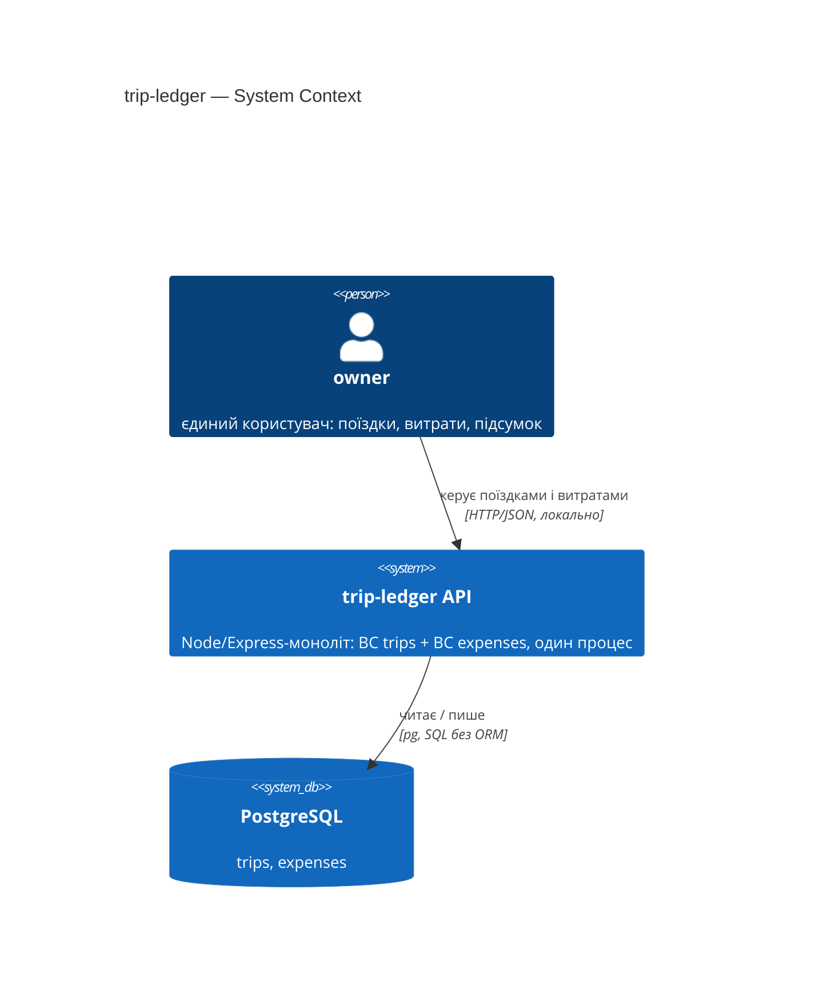
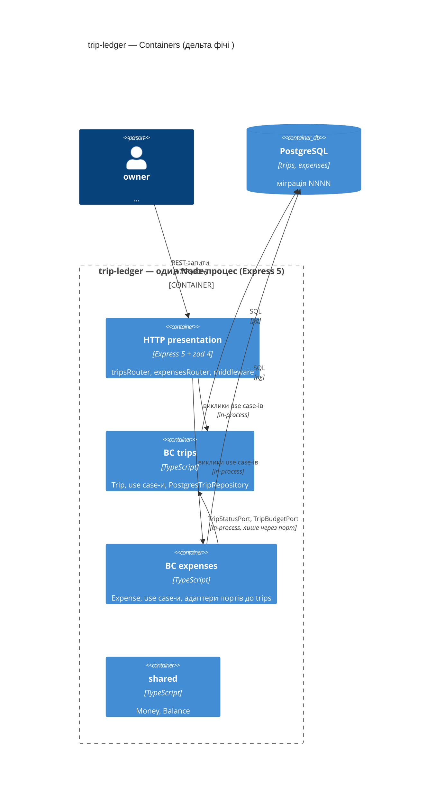
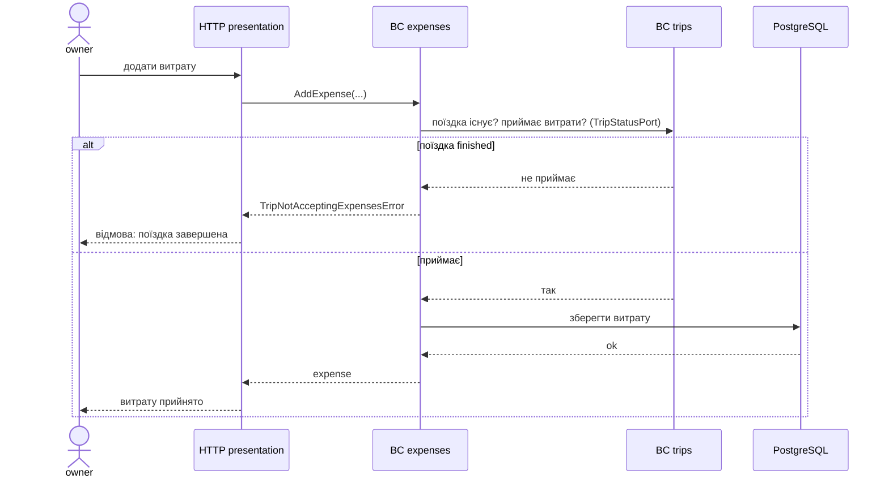

# C4 у Mermaid — шпаргалка для sad.md §3, §5, §6 (з прикладами з trip-ledger)

Перенесено з курсового `architecture-design/references/c4-mermaid-syntax.md`, скорочено до того, що реально потрібно моїм SAD, і доповнено робочими прикладами з trip-ledger та правилами для §6.

## Рівні

- **L1 Context** — система як чорний ящик + люди + зовнішні системи → **§3**.
- **L2 Container** — модулі/процеси/БД усередині системи → **§5**. У моноліті кожен BC = логічний контейнер.
- L3 Component / L4 Code — не малюємо: IDE покаже точніше, а дерево «Дельта файлів» у §5 дає рівно той зріз, який треба для задач.

Кордон довіри: на L1 — межа між нашими акторами й зовнішніми системами (у pet-інструментах зовнішніх зазвичай немає, і це записується словами); на L2 — `Container_Boundary` = те, що деплоїться разом (у моєму стеку — один Node-процес).

## Елементи

| Елемент | Синтаксис | Коли |
|---|---|---|
| Внутрішній актор | `Person(id, "name", "desc")` | роль з Glossary (`owner`, `agent`, …) |
| Зовнішній актор | `Person_Ext(id, "name", "desc")` | інша організація/команда |
| Наша система | `System(id, "name", "desc")` | L1: репо як ціле |
| Зовнішня система | `System_Ext(id, "name", "desc")` | інший процес/власник (провайдер, платіжка) |
| Наша БД на L1 | `SystemDb(id, "name", "desc")` | PostgreSQL |
| Контейнер | `Container(id, "name", "tech", "desc")` | L2: HTTP presentation, BC, shared, worker |
| БД на L2 | `ContainerDb(id, "name", "tech", "desc")` | PostgreSQL з таблицями фічі |
| Черга | `ContainerQueue(id, "name", "tech", "desc")` | лише якщо §4 ввів асинхронність |
| Рамка | `Container_Boundary(id, "label") { … }` | один deployment unit |
| Зв'язок | `Rel(from, to, "що", "як")` | протокол обов'язково: HTTP/JSON, SQL, in-process |

Правила: усі елементи оголошуються **до** `Rel`; 5–10 елементів на L1, 10–15 на L2; типові помилки — `Container_Bondary` / `ContainerBoundary` (Mermaid мовчки рендерить порожню рамку), `Rel` без підпису, внутрішні модулі на L1.

## §3 — C4Context (trip-ledger)



## §5 — C4Container з рекомендованими контейнерами мого стека

Контейнери для будь-якої фічі trip-ledger однакові; змінюються лише описи (що саме фіча додає) і стрілки портів між BC.



Якщо фіча вводить **зворотний порт** (`trips → expenses`) — стрілка з'являється на діаграмі лише разом з ADR, який це рішення пояснює.

## §6 — sequenceDiagram: правила і приклад

- Учасники — контейнери з §5 (`HTTP presentation`, `BC trips`, `BC expenses`, `PostgreSQL`), актор — роль з Glossary.
- Повідомлення **семантичні**: «додати витрату», «зберегти поїздку», `SetTripBudget(...)`, `TripNotFoundError`. Без `POST /trips/:id`, без `201`/`409` — це рівень стадії API contracts і її endpoint-level діаграм.
- Відмови — у `alt`-гілках з назвою типізованої помилки; інваріанти — у `Note over`.
- Після діаграми — рядок **Тестовий слід** з назвами тестів, які цей flow доводять.



**Тестовий слід:** `it('persists an expense for a trip that accepts expenses')`, `it('rejects an expense for a trip that does not accept expenses (domain invariant)')` — `src/expenses/application/AddExpense.test.ts`.

## Перевірка перед комітом

GitHub і Obsidian рендерять Mermaid нативно — відкрити файл і подивитись. Мінімальний regex-скан у скілі: парні фенси ` ```mermaid ` / ` ``` `, відсутність `<…>`-заглушок усередині блоків, відсутність `Bondary`/`ContainerBoundary`.
