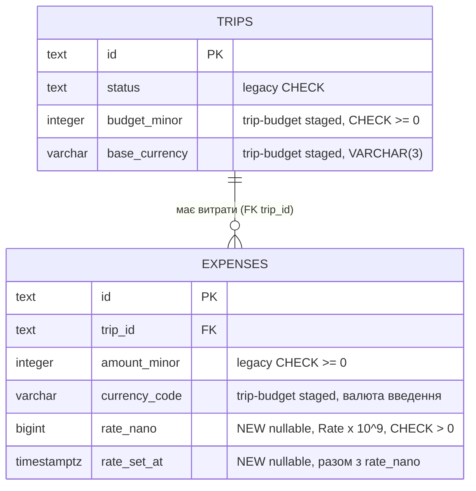

# Data model — multi-currency-summary

<!-- schema-forge. Staged-міграції: docs/features/multi-currency-summary/migrations/ у форматі node-pg-migrate.
Живе migrations/ не змінене; implement промотує з перештампуванням префікса. -->

Дві зміни на наявних таблицях, нових таблиць немає. `expenses` отримує rate snapshot — `rate_nano BIGINT` (курс ×10⁹, ADR-0001/0002) і `rate_set_at TIMESTAMPTZ` (джерело KPI PRD §7). `trips` отримує CHECK-и бюджету за ADR-0004: staged-міграція trip-budget вийшла взагалі без CHECK, тому тут спрацьовує fallback-шлях самого ADR-0004 — «ALTER … ADD CHECK у 0004». Спирається на staged `trip-budget/20260928120000_add_budget_to_trips` (колонки `budget_minor`, `base_currency`) і на ланцюжок `trip-budget/…120100–120300` (`expenses.currency_code`).

## Рішення ADR ↔ rules

| ADR | Що каже | Правило | Рішення |
|---|---|---|---|
| mcs 0001 / 0002 | `rate_nano BIGINT NULL CHECK (rate_nano > 0)` | CHECK дозволений, якщо він дзеркалить інваріант VO з `shared/`; `BIGINT` — лише з ADR | **Keep ADR** — `Rate` > 0 є інваріантом value object-а `Rate`, який ADR-0002 кладе в `shared/` (файлу ще немає — з'явиться при реалізації), а `BIGINT` задає сам ADR-0002 |
| mcs 0004 (cross) | `trips`: `CHECK (budget_minor IS NULL OR base_currency IS NOT NULL)` | форма складеного атрибута — дозволено | **Keep ADR** — budget без валюти не є `Money`; base currency без budget дозволена (сама суть ADR-0004) |
| trip-budget 0001 | `CHECK (budget_minor > 0)` як «друга лінія захисту» | продуктові пороги заборонені; `Money` ≥ 0 дозволений | **Amend ADR** — у БД `budget_minor >= 0` (дзеркало `Money`), `> 0` лишається в `Trip.setBudget()` і zod (AC-02). Back-port у trip-budget ADR-0001 / SAD §5 |
| — (правило скіла) | `rate_nano` і `rate_set_at` заповнюються лише разом | форма складеного атрибута | Додано `expenses_rate_snapshot_pair_chk`; в ADR цього немає, але й суперечності з ним немає |

## ER diagram

## Entities

### `expenses` (aggregate root — BC expenses)

| Column | Type | Constraints | Джерело | Notes |
|---|---|---|---|---|
| `rate_nano` | BIGINT | NULL, `expenses_rate_nano_positive_chk` | ADR-0001, ADR-0002 | **new.** `NULL` = курсу немає; для витрат у base currency курс 1 похідний на читанні і не пишеться (ADR-0003) |
| `rate_set_at` | TIMESTAMPTZ | NULL, `expenses_rate_snapshot_pair_chk` | ADR-0001, PRD §7 KPI | **new.** Перезаписується при кожній заміні курсу — не журнал (AC-05) |
| `currency_code` | VARCHAR(3) | NOT NULL після trip-budget contract | trip-budget data-model | не цієї фічі; SAD цієї фічі називає її «валюта введення» / `currency` |
| решта | — | — | legacy | без змін |

**Access patterns:**
- flow 1 «зберегти витрату (… rate_nano + rate_set_at або NULL)» → upsert по PK.
- flow 3 «знайти витрату» (`findById`, новий метод) → PK.
- flow 2 «усі витрати поїздки» → `idx_expenses_trip_id`.
- flow 3 `RatedExpensesPort` «є витрати з явним rate snapshot?» → `EXISTS (… WHERE trip_id = $1 AND rate_nano IS NOT NULL)` → `idx_expenses_trip_id`.

### `trips` (aggregate root — BC trips)

| Column | Type | Constraints | Джерело | Notes |
|---|---|---|---|---|
| `budget_minor` | INTEGER | NULL, `trips_budget_minor_nonneg_chk` | trip-budget ADR-0001 (amended) | колонка з trip-budget staged, CHECK — тут |
| `base_currency` | VARCHAR(3) | NULL, `trips_budget_has_currency_chk` | ADR-0004 | самостійний атрибут: може існувати без budget |

**Access patterns:** flow 3 «зберегти поїздку з новою base currency» → upsert по PK.

## CHECK

| Constraint | Вираз | Клас | Дзеркало чого | Проба (має впасти) |
|---|---|---|---|---|
| `expenses_rate_nano_positive_chk` | `rate_nano > 0` | (а) | `Rate` у `shared/` (запланований ADR-0002): курс додатний | `rate_nano = 0`, `rate_nano = -912300000` |
| `expenses_rate_snapshot_pair_chk` | `(rate_nano IS NULL) = (rate_set_at IS NULL)` | (б) | rate snapshot = курс + час задання | курс без часу; час без курсу |
| `trips_budget_has_currency_chk` | `budget_minor IS NULL OR base_currency IS NOT NULL` | (б) | budget = `Money` (сума + валюта), ADR-0004 | `budget_minor = 100000` без валюти |
| `trips_budget_minor_nonneg_chk` | `budget_minor >= 0` | (а) | `shared/Money`: невід'ємні minor units | `budget_minor = -1` |
| legacy 0001/0002 | `status IN …`, `category IN …`, `ends_at >= starts_at`, `amount_minor >= 0` | — | — | не чіпаємо; enum-CHECK за моїми правилами заборонені для нового коду |

Проби: [`check-probes.sql`](./check-probes.sql). Таблиці малі (SAD §7: ≤ ~2 тис. витрат на рік), тож CHECK додається одним `ALTER` без `NOT VALID`.

## Breaking changes

Немає. Обидві міграції expand-only: nullable колонки й CHECK, яким задовольняють усі наявні рядки (нові колонки — `NULL`, budget ще ніде не задано). Backfill курсу 1 з PRD §9 свідомо не робимо (ADR-0003).

## Indexes

| Index | Columns | Query it serves | Рядків у зрізі | Рішення |
|---|---|---|---|---|
| `idx_expenses_trip_id` (існує) | `expenses(trip_id)` | flow 2 «усі витрати поїздки»; flow 3 `RatedExpensesPort` | ≤ 300 на поїздку (SAD §7) | використовується як є |
| кандидат `(trip_id) WHERE rate_nano IS NOT NULL` | partial | flow 3 `RatedExpensesPort` | ≤ 300 | **відхилено** — `EXISTS` по ≤ 300 рядках через наявний індекс займає частки мілісекунди, а partial-індекс коштує запису на кожну заміну курсу |
| кандидат `(rate_set_at)` | — | KPI PRD §7 «курс у день витрати» | уся таблиця, ~2 тис. рядків на рік | **відхилено** — аналітичний запит раз на поїздку, seq scan дешевший за підтримку індексу |

## Domain ↔ columns

| Domain field | Column | Статус |
|---|---|---|
| `Expense.id`, `tripId`, `category`, `spentAt` | `id`, `trip_id`, `category`, `spent_at` | exists |
| `Expense.amount: Money` → `amount` | `amount_minor` | exists |
| `Expense.amount: Money` → `currency` | `currency` → `currency_code` | expected-staged (trip-budget 120100–120300) |
| `Expense.rate?: Rate` | `rate_nano` | expected-staged (цей `…140000`) |
| `Expense.rateSetAt?: Date` | `rate_set_at` | expected-staged (цей `…140000`) |
| `Trip.budget?: Money` | `budget_minor` + `base_currency` | expected-staged (trip-budget 120000) |
| `Trip.baseCurrency?: string` | `base_currency` | expected-staged (trip-budget 120000) |

Real drift: немає — поточний код 1:1 з живими `0001`/`0002`.

## Promotion order

1. `trip-budget/20260928120000_add_budget_to_trips` — колонки `budget_minor`, `base_currency`, на які посилаються CHECK-и цієї фічі.
2. `multi-currency-summary/20260928140000000_add_rate_snapshot_to_expenses` — незалежна від ланцюжка `currency_code`, може йти будь-коли після п. 1.
3. `multi-currency-summary/20260928140100000_add_budget_checks_to_trips` — одним деплоєм з п. 1, щоб колонки budget не жили в проді без CHECK (Amendment ADR-0001 trip-budget).
4. `trip-budget/…120100` → `…120200` → `…120300` — окремими PR. До коду кроку 2 `BudgetBlock` порівнює валюти по `currency`, після — по `currency_code`.

Під правилами schema-forge staged-пари trip-budget (golang-migrate) при промоції переписуються в один `.sql` node-pg-migrate на кожну пару; backfill з `COMMIT` у `DO` — у `.js` з `pgm.noTransaction()`, бо в `.sql` раннер тримає транзакцію.

**Перештампування префікса обов'язкове, а не косметичне.** node-pg-migrate 8 розбирає як час лише 13- (epoch ms) або 17-значні (utc) префікси. 14-значний префікс golang-migrate (`20260928120000`) він бере як число ≈ 2.03·10¹³, і воно сортується **після** будь-якого 17-значного (≈ 1.79·10¹² мс). Якщо промотувати пари trip-budget без перештампування, `…140100000` (CHECK на `budget_minor`) піде раніше за `…120000` (створює колонку) і впаде. При промоції всі файли отримують 17-значний utc-префікс у порядку з цього списку.

## Roundtrip

`scripts/db-roundtrip.sh docs/features/multi-currency-summary/migrations --after docs/features/trip-budget/migrations --probes docs/features/multi-currency-summary/check-probes.sql` — Postgres 17, node-pg-migrate 8.0.4; baseline = живі 0001/0002 + сид + up-частина staged trip-budget. Down повертає baseline, другий up дає той самий `pg_dump -s`, 6/6 проб упали на своїх CHECK. Вивід — в аудиті.

## Test fixtures

- `anExpense({ tripId, currency?, rate?, rateSetAt? })` — `src/expenses/testing/anExpense.ts`; TBD до появи `rate` у `Expense` (інакше `tsc` впаде).
- `aTrip({ budget?, baseCurrency? })` — спільна з trip-budget, `src/trips/testing/aTrip.ts`.
