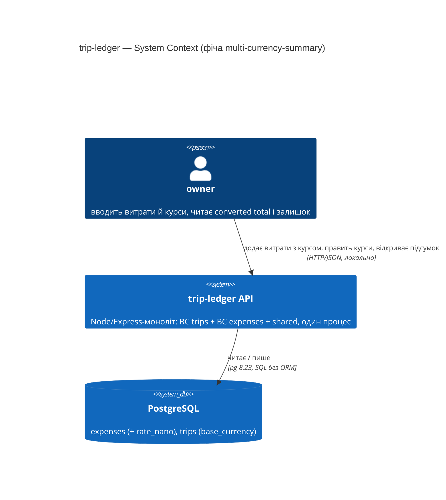
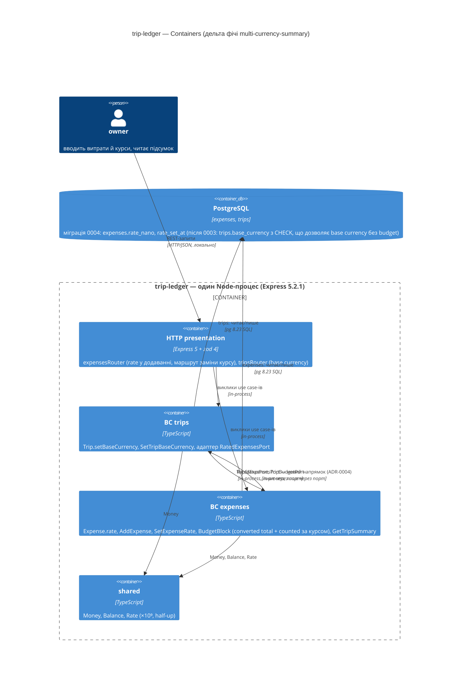

# Software Architecture Document — multi-currency-summary

<!-- arch-forge: 12 секцій arc42. Порожня секція — лише як <!-- N/A: причина --> (§7 має фіксований текст нижче). -->
<!-- C4 Context (L1) — inline у §3; C4 Container (L2) — inline у §5; L3/L4 не малюємо. -->
<!-- Джерела за пріоритетом: кореневий CONTEXT.md (Glossary + Invariants) → PRD → Explore-звіт → рішення попередніх секцій. -->
<!-- Заповнені приклади: docs/features/trip-budget/sad.md (курсовий скіл), docs/features/<наступна>/sad.md (цей скіл). -->

## 1. Introduction and goals

**Intent.** multi-currency-summary робить підсумок поїздки чесним для 2–3 валют: на витраті в чужій валюті owner може зафіксувати `rate snapshot` — курс до `base currency`, записаний один раз і більше не оновлюваний; підсумок показує `converted total` у base currency **поруч** із сирими сумами по валютах і лічильник витрат без курсу. Витрата з курсом входить у порівняння з `budget` — залишок із trip-budget перестає брехати на мультивалютних поїздках (PRD AC-09). Це Approach C з idea-brief §13 (RICE 7): жодних зовнішніх джерел курсів, жодних історичних довідників.

Brownfield: розширює BC `expenses` (атрибут витрати, новий use case, агрегат підсумку) і `shared` (арифметика курсу); торкається BC `trips` через правило незмінності base currency (AC-07). Спирається на прийняту архітектуру сусідньої фічі: [[../trip-budget/sad.md]] — `BudgetBlock` і `TripBudgetPort` (її ADR-0002), `Balance` (ADR-0004), `base_currency` на `trips` (ADR-0001).

**Decision overrides (критик, F2).**
- ARCHITECTURE.md «`trips` … нічого не знає про витрати» (і trip-budget ADR-0002, яка виключила зворотний порт саме цим правилом) — overridden by author, rationale: AC-07 неможливо виконати без факту «є витрати з курсом» на боці `trips`; правило звужується до «жодних прямих імпортів між BC», зворотний зв'язок дозволений лише портом з окремим ADR (ADR-0004); ARCHITECTURE.md оновлюється разом із фічею (§11).
- PRD §9 «одне nullable-поле, нових сутностей немає» — overridden by author, rationale: без керування base currency у `trips` (use case + маршрут) AC-06/AC-07 не мають опори, а без `rate_set_at` KPI PRD §7 «курс у день витрати» неможливо виміряти; back-port US/AC про base currency і другої колонки у PRD — §11.

**Top-3 quality goals (1-liners; сценарії у §10; терміни у §12):**

1. **QG-1 Точність перерахунку — похибка ≤ 1 minor unit на витрату.** Цілочислова арифметика у minor units з фіксованим правилом округлення half-up; плаваюча точка заборонена (PRD §6 NFR «Точність перерахунку»).
2. **QG-2 Латентність існуючих ендпойнтів не деградує.** Підсумок з converted total — p95 ≤ 250 ms; збереження/правка курсу — p95 ≤ 150 ms; ≥ 30 req/s на 1 інстанс (PRD §6 NFR).
3. **QG-3 Інваріанти словника тримаються у типах, не в домовленостях.** Rate snapshot фіксується один раз і ніколи не оновлюється сам; витрата зберігає суму й валюту введення — перерахунок є шаром поверх; base currency не змінюється, поки є витрати з курсом (AC-07); finished не блокує дозаповнення курсів (AC-08).

**Stakeholders.**

| Role | Interest | Sign-off owner? |
|---|---|---|
| `owner` | Єдиний користувач: вводить курс разом із витратою або постфактум, читає converted total поруч із сирими сумами, звіряє залишок бюджету | No |
| Tech Lead (я ж, автор фічі) | Архітектурний sign-off, ADR, dependency rule між BC — особливо новий напрямок порту (ADR-0004) | **Yes** |

## 2. Constraints

**Technical.** (Explore-скан проти `package-lock.json`, `migrations/` і SAD trip-budget)
- TypeScript 7.0.2 (`strict`, `NodeNext`) · Node ≥ 22 (локально v24.18.0) · Express 5.2.1 · pg 8.23.0 без ORM (docs/adr/0001) · zod 4.4.3 лише у presentation · vitest 4.1.11 + supertest 7.2.2 поверх `createApp` з in-memory репозиторіями.
- PostgreSQL — версія в репо не зафіксована (→ §11, той самий борг, що у trip-budget). `BIGINT` для курсу — стандартний тип, драйвер `pg` повертає його рядком → мапінг у `BigInt` в репозиторії.
- Схема зараз: `trips(id, title, country, starts_at, ends_at, status)`, `expenses(id, trip_id FK, amount_minor INTEGER CHECK ≥ 0, currency TEXT, category, spent_at)`. Колонки курсу **немає**. За SAD trip-budget міграція `0003` додає `trips.budget_minor`, `trips.base_currency` (nullable) — ця фіча йде **після** неї; наступна міграція — `0004`.
- У `expenses` немає жодного шляху змінити витрату після створення: ні use case, ні маршруту; `ExpenseRepository` має лише `save` (upsert) і `findByTrip` — `findById` доведеться додати.

**Organisational.**
- Effort: S (idea-brief §11 після зрізання scope). Deadline: поїздка у жовтні 2026 — **жорсткий** сезонний; послідовність: реалізація trip-budget (міграція 0003) → ця фіча. Team: 1 людина.

**Conventions.**
- CLAUDE.md: Clean Architecture, чотири шари на BC, `domain/` без фреймворків; BC не імпортують один одного напряму — лише `shared/` або порт із адаптером в `infrastructure/` (прецедент `TripRepositoryStatusPort`).
- ARCHITECTURE.md «`trips` … нічого не знає про витрати» — у цій фічі свідомо порушується портом `RatedExpensesPort` (Override у §1; ADR-0004; оновлення документа — §11).
- Помилки: типізовані Error-класи → 404 / 409 / 422 у presentation; ID — `randomUUID()` у application; гроші — `Money` у minor units, `Balance` для різниць (trip-budget ADR-0004).
- AC → назва vitest-теста; міграції — нумеровані SQL-файли; PRD §9 називає дельту даних наперед (одне nullable-поле на `expenses`).

**Regulatory / external.**
- Немає: нове поле — число без PII (PRD §6.1), security review N/A. Межа доступу успадкована з trip-budget §8 (bind 127.0.0.1 + API-key).

## 3. Context and scope

trip-ledger — локальний single-user REST API обліку поїздок і витрат. Фіча не додає зовнішніх систем принципово: курс вводить owner руками (інваріант словника «жодних зовнішніх залежностей за курсами», PRD §3), тому банківські API, довідники ЄЦБ чи TravelSpend-подібні джерела за кордоном системи відсутні за рішенням. Кордон довіри — процес API: курс валідується zod-ом на межі як додатне число з ≤ 9 знаками після коми.

**Зовнішні системи — немає (свідомо; єдина «зовнішня» сутність — власна БД).**

<!-- brownfield: Explore-скан виконано 2026-09-02 (див. §2 Technical) -->

**External systems (in / out):**

| Actor or system | Type | Interaction |
|---|---|---|
| `owner` | Person | Вводить витрату з курсом або без; доставляє/виправляє курс постфактум (і у finished поїздці); читає підсумок із converted total; задає base currency поїздки |
| PostgreSQL | System (own datastore) | `expenses` (+ `rate_nano`), `trips` (`base_currency` з міграції 0003 trip-budget) |
| Джерела курсів валют | — | Відсутні за рішенням (PRD §3, CONTEXT «Out of scope») |

**C4 Context (L1):**



## 4. Solution strategy

**Стратегічні стовпи (насіння для ADR):**

1. **Курс — атрибут витрати, зафіксований один раз; не журнал і не довідник.** Словник: «rate snapshot — курс до base currency, зафіксований на витраті один раз для перерахунку. NOT живий курс». PRD §3 виключає історію курсів, AC-05 каже: заміна просто перезаписує значення. Тож курс лягає однією nullable-колонкою на `expenses` (міграція 0004) і полем `rate?` на `Expense`; правка — новий use case `SetExpenseRate`, дозволений у finished поїздці (AC-08 — це не додавання витрати, інваріант «finished блокує нові витрати» не зачеплений). Зачіпає базу + чесні альтернативи (окрема таблиця курсів, довідник за датою) → **ADR-0001**.
2. **Курс зберігаємо й рахуємо цілим числом зі шкалою 10⁹, округлення half-up — одне правило на всю систему.** NFR «похибка ≤ 1 minor unit на витрату» + конвенція trip-budget §8 «плаваюча точка заборонена». Вхід і зберігання — до 9 знаків після коми: PRD §8 OQ #1 пропонував 6, але похибку визначає саме грануляція вводу, а не шкала зберігання — для курсів на кшталт VND→EUR (≈ 0.000037037) шість знаків обрізають до 0.000037, це ~0.1% відносної похибки, яка на сумах від 10⁸ minor units дає понад 1 minor unit; тому ліміт вводу піднято до 9, а шкала зберігання дорівнює йому, щоб нічого не обрізати. Half-up (PRD §8 OQ #3, дефолт) фіксується тут, а не на стадії data model — бо це рішення про `shared/`, а не про колонку. → **ADR-0002**.
3. **Counted expense переозначується: «має ефективний курс», а не «у base currency»; converted total і remaining живляться з однієї функції.** PRD Goal 3 і AC-09 вимагають, щоб витрата з курсом входила у порівняння з budget. Тому `BudgetBlock` із trip-budget (її ADR-0002) рахує Σ counted у перерахованих сумах; витрата у base currency має похідний курс 1 (AC-06) — без збереження і без backfill, який передбачав PRD §9. Лічильник «без курсу» для converted total і лічильник uncounted для remaining — одне й те саме число. → **ADR-0003**; уточнює визначення counted/uncounted у `docs/features/trip-budget/CONTEXT.md` (→ `fix-term`, §11).

Четвертий стовп виріс не зі стратегії, а з §5: щоб AC-06 і AC-07 мали сенс, base currency має існувати незалежно від budget і бути заблокованою, поки є витрати з курсом — це рішення про напрямок портів між BC (**ADR-0004**).

Кожне тактичне рішення §5–§8 має простежуватись до одного зі стовпів; рішення, що суперечить стовпу, — рядок у §11.

## 5. Building block view

Стиль без змін — Clean Architecture з портами між BC. Фіча розширює `expenses` (атрибут, use case, агрегат), `shared` (value object курсу) і — несподівано для PRD — `trips`: у trip-budget base currency з'являлась лише разом із budget (її ADR-0001), а тут AC-06 («курс 1 для base currency сам») і AC-07 («не змінювати base currency, поки є курси») потрібні й поїздці без бюджету. Тому base currency стає **самостійним атрибутом поїздки** (задається при створенні або окремим use case; задання budget лишається сумісним — фіксує її, якщо ще не задана), а перевірка «є витрати з курсом?» іде через **зворотний порт** `RatedExpensesPort` у `trips/domain` з адаптером у `trips/infrastructure` поверх `ExpenseRepository` — дзеркало `TripRepositoryStatusPort`, але у другий бік. Це перший двонапрямний зв'язок між BC у репо — саме тому ADR-0004, а не рядок у §8. Семантика локу: зміну **вже заданої** base currency блокує лише **явний** rate snapshot (`rate_nano IS NOT NULL`); перше задання дозволене завжди; витрати у base currency з похідним курсом 1 лок не тримають — після зміни валюти вони чесно стають «без курсу» і видні у лічильнику. Дзеркальне правило на боці `expenses`: курс на витраті приймається лише коли у поїздки вже є base currency, інакше `BaseCurrencyNotSetError` — щоб не з'явилась витрата з курсом «до нічого», яка потім заблокувала б задання валюти. `SetTripBudget` із trip-budget іде тим самим `Trip.setBaseCurrency`, коли фіксує валюту разом із бюджетом.

Контракти: підсумок отримує блок `converted: { total, withoutRate } | null` (null — поки у поїздки немає base currency); відповідь додавання витрати — поле `rate` у `expense` (обов'язковий контракт — стадія API). Breaking change тут менший, ніж у trip-budget (форма вже об'єкт/envelope за її §5), але блок `budget` змінює семантику counted → §11.

**Дельта файлів (`+` новий, `~` змінюється):**

```
src/
├── shared/
│   ├── Money.ts                                     (без змін)
│   ├── Balance.ts                                   (з trip-budget ADR-0004, без змін)
│   └── Rate.ts                                    + ADR-0002: BigInt ×10⁹, Rate.parse('0.9123'), apply(Money) → Money (half-up), ONE = 10⁹
├── expenses/
│   ├── domain/Expense.ts                          ~ + rate?: Rate, rateSetAt?: Date, withRate(); ExpenseRepository + findById(id); TripBudgetPort розширено до { baseCurrency: string | null, budget: Money | null } — base currency існує й без budget (ADR-0004)
│   ├── domain/errors.ts                           ~ + ExpenseNotFoundError, BaseCurrencyNotSetError
│   ├── application/AddExpense.ts                  ~ необов'язковий rate у вході (AC-01/AC-02); rate без base currency поїздки → BaseCurrencyNotSetError
│   ├── application/SetExpenseRate.ts              + замінити курс на збереженій витраті; без TripStatusPort — дозволено у finished (AC-05/AC-08); та сама перевірка base currency; пише rateSetAt = now (KPI PRD §7)
│   ├── application/BudgetBlock.ts                 ~ counted = має ефективний курс; Σ у перерахованих сумах; + convertedTotal, withoutRate (ADR-0003)
│   ├── application/GetTripSummary.ts              ~ + converted: { total: Money(base), withoutRate } | null
│   ├── infrastructure/PostgresExpenseRepository.ts ~ мапінг rate_nano (string → BigInt), rate_set_at; findById
│   ├── infrastructure/InMemoryExpenseRepository.ts ~ findById
│   └── presentation/expensesRouter.ts             ~ rate у схемі додавання (додатне, ≤ 6 знаків); маршрут заміни курсу
├── trips/
│   ├── domain/Trip.ts                             ~ + setBaseCurrency(currency, hasRatedExpenses): перше задання — завжди; зміна — лише без явних курсів, інакше BaseCurrencyLockedError; RatedExpensesPort (ADR-0004)
│   ├── application/CreateTrip.ts                  ~ необов'язкова baseCurrency при створенні
│   ├── application/SetTripBaseCurrency.ts         + задати/змінити base currency з перевіркою порту (AC-07)
│   ├── infrastructure/ExpenseRepositoryRatedPort.ts + адаптер зворотного порту поверх ExpenseRepository
│   └── presentation/tripsRouter.ts                ~ baseCurrency у створенні; маршрут зміни base currency
├── presentation/app.ts                            ~ зшивання RatedExpensesPort (trips ← expenses) поряд із TripStatusPort/TripBudgetPort
migrations/
└── 0004_add_expense_rate.sql                      + ALTER TABLE expenses ADD rate_nano BIGINT NULL CHECK (rate_nano > 0), ADD rate_set_at TIMESTAMPTZ NULL; expand-only, backfill немає (CHECK trips — див. «Дельта міграцій»)
```

**Дельта міграцій:** `migrations/0004_add_expense_rate.sql` — `ALTER TABLE expenses ADD COLUMN rate_nano BIGINT NULL CHECK (rate_nano > 0), ADD COLUMN rate_set_at TIMESTAMPTZ NULL` (час останнього задання курсу — перезаписується, не журнал; джерело для KPI PRD §7 «курс у день витрати»); expand-only; backfill **немає** — PRD §9 передбачав backfill курсу 1 для витрат у base currency, але правило «валюта витрати = base currency ⇒ курс 1» похідне й обчислюється на читанні (ADR-0003), тож старі рядки лишаються `NULL` і вже counted. CHECK з trip-budget має дозволяти base currency без budget: `(budget_minor IS NULL OR base_currency IS NOT NULL)` замість `(budget_minor IS NULL) = (base_currency IS NULL)` — оскільки міграція 0003 ще не написана, правильна форма іде одразу в 0003 (правка trip-budget SAD §5 при реалізації, §11); якщо 0003 уже застосована у чиємусь середовищі — `ALTER TABLE trips DROP CONSTRAINT … ADD CHECK (…)` у 0004. Передумова: 0003 перед 0004.

**C4 Container (L2):**



## 6. Runtime view

Учасники — контейнери з §5; повідомлення семантичні, без HTTP-дієслів і шляхів (ендпойнт-рівневі діаграми — стадія API contracts).

**Critical flow 1: owner додає витрату — з курсом, без курсу або у base currency** — US-01, US-05; AC-01, AC-02, AC-06.

```mermaid
sequenceDiagram
    actor O as owner
    participant HTTP as HTTP presentation
    participant E as BC expenses
    participant T as BC trips
    participant DB as PostgreSQL

    O->>HTTP: додати витрату (сума, валюта, категорія, дата, курс?)
    HTTP->>HTTP: перевірити форму: курс, якщо є, — додатне число, ≤ 9 знаків
    alt курс нульовий або від'ємний
        HTTP-->>O: відмова з поясненням: курс має бути додатним числом (AC-02)
    else форма валідна
        HTTP->>E: AddExpense(..., rate?)
        E->>T: поїздка існує? приймає витрати? (TripStatusPort)
        alt поїздка finished
            T-->>E: не приймає
            E-->>HTTP: TripNotAcceptingExpensesError
            HTTP-->>O: відмова: поїздка завершена
        else приймає
            T-->>E: так
            E->>T: budget і base currency поїздки (TripBudgetPort)
            T-->>E: base currency (+ budget) або «не задано»
            alt курс вказано, а base currency у поїздки ще немає
                E-->>HTTP: BaseCurrencyNotSetError
                HTTP-->>O: відмова з поясненням: спершу задай base currency поїздки — інакше курс «до нічого»
            else курсу немає або base currency є
                E->>DB: зберегти витрату (сума й валюта введення; rate_nano + rate_set_at або NULL)
                DB-->>E: ok
                Note over E: валюта витрати = base currency ⇒ ефективний курс 1, поле не потрібне (AC-06)
                E->>E: BudgetBlock над витратами поїздки (counted за ефективним курсом)
                E-->>HTTP: { expense (з rate), budget: BudgetBlock | null }
                HTTP-->>O: витрату прийнято; якщо курс є або валюта базова — вона вже у converted total і в залишку
            end
        end
    end
```

**Тестовий слід:** `it('stores an optional rate snapshot with a foreign-currency expense')`, `it('rejects a zero or negative rate')`, `it('rejects a rate for a trip without base currency')`, `it('counts a base-currency expense with an implied rate of 1 without asking for a rate')` — `src/expenses/application/AddExpense.test.ts`, `src/expenses/presentation/expenses.http.test.ts`.

**Critical flow 2: owner відкриває підсумок — сирі суми, converted total, лічильник без курсу, залишок** — US-02, US-03; AC-03, AC-03b, AC-04, AC-09.

```mermaid
sequenceDiagram
    actor O as owner
    participant HTTP as HTTP presentation
    participant E as BC expenses
    participant T as BC trips
    participant DB as PostgreSQL

    O->>HTTP: відкрити підсумок поїздки
    HTTP->>E: GetTripSummary(tripId)
    E->>DB: усі витрати поїздки
    DB-->>E: expenses[] (з rate_nano або NULL)
    E->>E: рядки по (категорія, валюта) — сирі суми, як зараз
    E->>T: base currency і budget поїздки (TripBudgetPort)
    alt base currency не задана
        T-->>E: немає
        E-->>HTTP: { lines, converted: null, budget: null } — підсумок як раніше
    else base currency задана
        T-->>E: base currency (+ budget або «не задано»)
        E->>E: для кожної витрати: ефективний курс = rate або 1 (базова валюта) або відсутній
        E->>E: converted total = Σ Rate.apply(amount) (half-up, minor units); withoutRate = кількість без курсу
        Note over E: та сама функція BudgetBlock: remaining = budget − converted Σ counted (Balance зі знаком)
        E-->>HTTP: { lines, converted: { total, withoutRate }, budget: BudgetBlock | null }
    end
    HTTP-->>O: сирі суми ТА converted total поруч; лічильник чесно каже, скільки витрат поза перерахунком
```

**Тестовий слід:** `it('shows raw per-currency totals and a converted total from rated expenses only')`, `it('keeps precision for tiny-rate currencies (no rounding to zero)')` (AC-03b), `it('counts expenses without a rate next to the converted total')`, `it('includes a rated foreign-currency expense in the budget remaining')` (AC-09) — `src/expenses/application/GetTripSummary.test.ts`.

**Critical flow 3: постфактум-правки — курс на витраті у finished поїздці та спроба змінити base currency** — US-04, US-06; AC-05, AC-07, AC-08.

```mermaid
sequenceDiagram
    actor O as owner
    participant HTTP as HTTP presentation
    participant E as BC expenses
    participant T as BC trips
    participant DB as PostgreSQL

    O->>HTTP: замінити курс на збереженій витраті (поїздка finished)
    HTTP->>E: SetExpenseRate(expenseId, rate)
    E->>DB: знайти витрату
    alt витрати немає
        DB-->>E: порожньо
        E-->>HTTP: ExpenseNotFoundError
        HTTP-->>O: відмова: витрату не знайдено
    else витрата є
        DB-->>E: expense
        Note over E: статус поїздки НЕ перевіряється — finished блокує нові витрати, не атрибути наявних (AC-08); base currency у поїздки має бути (інакше BaseCurrencyNotSetError, як у flow 1)
        E->>E: expense.withRate(rate) — сума й валюта введення не змінюються; rateSetAt = now
        E->>DB: зберегти витрату (upsert)
        DB-->>E: ok
        E-->>HTTP: expense з новим курсом
        HTTP-->>O: курс замінено; попереднє значення ніде не зберігається (AC-05)
    end

    O->>HTTP: змінити base currency поїздки
    HTTP->>T: SetTripBaseCurrency(tripId, currency)
    Note over T: перше задання base currency порт не питає — дозволене завжди
    T->>E: є витрати з ЯВНИМ rate snapshot? (RatedExpensesPort; похідний курс 1 не рахується)
    alt є хоча б одна
        E-->>T: так
        T-->>HTTP: BaseCurrencyLockedError
        HTTP-->>O: відмова з поясненням: зафіксовані курси втратили б сенс — спершу поїздка без курсів (AC-07)
    else немає
        E-->>T: ні
        T->>DB: зберегти поїздку з новою base currency
        DB-->>T: ok
        T-->>HTTP: trip
        HTTP-->>O: base currency змінено; витрати у старій валюті відтепер «без курсу» і видні у лічильнику
    end
```

**Тестовий слід:** `it('replaces the rate on a stored expense even when the trip is finished')` (AC-08), `it('does not keep the previous rate anywhere')` (AC-05), `it('records when the rate was set')` — `src/expenses/application/SetExpenseRate.test.ts`; `it('always allows the first base currency assignment')`, `it('blocks changing base currency while explicitly rated expenses exist')`, `it('ignores implied rate-1 expenses when deciding the base currency lock')` — `src/trips/application/SetTripBaseCurrency.test.ts`.

## 7. Deployment view

<!-- N/A: фіча переюзає існуючий деплой — один Node-процес + PostgreSQL; реплік, порогів масштабування й моніторингу не змінює -->

Обґрунтування одним рядком: одна nullable-колонка, два use case-и й один value object усередині того самого процесу; обсяг — 4–6 поїздок на рік × ≤ 300 витрат, 2–3 валюти на поїздку (PRD §1).

## 8. Crosscutting concepts

| Concept | Convention | Where defined |
|---|---|---|
| Error handling | типізовані доменні Error-класи → presentation: відсутність 404 (`ExpenseNotFoundError` — новий), порушення правила даних 422 (zod для курсу; `BaseCurrencyNotSetError` — новий: курс без base currency поїздки), відмова інваріанту AC-07 → 409 (`BaseCurrencyLockedError` — новий, як відмова state-подібного правила) | CLAUDE.md; `expenses/domain/errors.ts`, `trips/domain/errors.ts` |
| Validation | zod лише на межі presentation; `rate` — додатне число з ≤ 9 знаками після коми (PRD §8 OQ #1 пропонував 6 — переглянуто заради NFR точності на дрібних курсах, ADR-0002); зберігання — та сама шкала 10⁹ | `expensesRouter.ts`; ADR-0002 |
| Money & precision | `Money` — цілі minor units, невід'ємний; `Balance` — знакові (trip-budget ADR-0004); `Rate` — `BigInt` ×10⁹, `apply()` з округленням half-up, `ONE` для базової валюти; плаваюча точка заборонена в усьому ланцюжку від zod до БД | `src/shared/`; ADR-0002 |
| ID strategy | `randomUUID()` (v4) у application; курс власного id не має — атрибут `Expense` (ADR-0001) | CLAUDE.md |
| Access boundary | успадковано з trip-budget §8: bind 127.0.0.1 + API-key middleware (SPEC.md), 401 без деталей | trip-budget sad.md §8 |
| Cross-BC access | лише порти з адаптерами в `infrastructure/`; тепер **двонапрямно**: `expenses → trips` (`TripStatusPort`, `TripBudgetPort`) і `trips → expenses` (`RatedExpensesPort`, ADR-0004); зшивання обох напрямків — тільки в `app.ts`; прямих імпортів між BC як і раніше немає | CLAUDE.md; ADR-0004 |
| Persistence & migrations | нумеровані SQL-файли; 0004 — expand-only nullable без backfill (курс 1 похідний, ADR-0003): `rate_nano` + `rate_set_at` (перезаписується при кожній заміні курсу — не журнал); `BIGINT` ↔ `BigInt` через рядок у мапінгу репозиторію; upsert `ON CONFLICT (id) DO UPDATE` без змін | `migrations/`; `PostgresExpenseRepository.ts` |
| Logging / Observability | `console` + request-timing middleware з trip-budget §8; латентність міряємо k6 smoke у CI і таймінгами supertest; трасування немає. KPI PRD §7 «курс у день витрати» рахується з даних: `rate_set_at` проти `spent_at` | trip-budget sad.md §8; §5 |
| Rate limiting | Немає у v1 → відкрите питання у §11 (PRD §6.1: 60/хв на правки курсу; due стадія API — разом із лімітом trip-budget) | §11 |
| Internationalisation | N/A — повідомлення англійською, як у коді | — |

## 9. Architecture decisions

| # | BC | Title | Status | Section |
|---|---|---|---|---|
| 0001 | expenses | Зберігати rate snapshot nullable-колонкою на `expenses` (атрибут `Expense`), правити окремим use case без перевірки статусу поїздки | Accepted | §4 |
| 0002 | shared | Представляти курс як `Rate` — `BigInt` ×10⁹ з округленням half-up; вхід ≤ 9 знаків | Accepted | §4, §8 |
| 0003 | expenses | Counted expense = має ефективний курс; converted total і remaining — з однієї `BudgetBlock`; курс 1 для base currency похідний, без backfill | Accepted | §4, §5 |
| 0004 | cross | Задавати base currency окремо від budget і блокувати її зміну через зворотний порт `RatedExpensesPort` (`trips → expenses`) | Accepted | §5, §8 |

ADR files live under `docs/features/multi-currency-summary/adr/NNNN-<bc>-<title>.md`.

Дивись: [[adr/0001-expenses-rate-snapshot-as-nullable-column-on-expenses]] · [[adr/0002-shared-rate-as-bigint-scaled-1e9-half-up]] · [[adr/0003-expenses-counted-means-has-effective-rate]] · [[adr/0004-cross-base-currency-standalone-locked-via-rated-expenses-port]]

## 10. Quality requirements

**QG-1. Точність перерахунку**
- **When:** витрата 100 000 000 minor units у валюті з курсом 0.000037037 (9 знаків) до base currency (VND-подібний випадок); окремо — випадкові пари (сума, курс) у property-тесті; окремо — курс 0.9123 на суму 1 999 minor units.
- **Then:** перерахована сума відрізняється від точного добутку не більше ніж на 1 minor unit; для дрібної валюти результат не округлюється в нуль (PRD §6 NFR «Точність перерахунку», AC-03b); правило округлення half-up однакове для converted total і для remaining.
- **How verify:** `src/shared/Rate.test.ts` — `it('applies a rate with at most 1 minor unit of error (half-up)')`, property-тест на випадкових BigInt; `GetTripSummary.test.ts` — `it('keeps precision for tiny-rate currencies (no rounding to zero)')`.

**QG-2. Латентність і пропускна здатність**
- **When:** поїздка з 300 витратами у 3 валютах, частина з курсами; owner відкриває підсумок і замінює курс на одній витраті.
- **Then:** підсумок із converted total — p95 ≤ 250 ms; збереження/правка курсу — p95 ≤ 150 ms; ≥ 30 req/s на 1 інстанс (PRD §6 NFR, числа дослівно).
- **How verify:** k6 smoke у CI на `GET /trips/:id/summary` і на write-ендпойнт курсу (PRD §6 «Measurement»); локально — `it('summary with converted total responds under 250 ms for 300 mixed-currency expenses')` у `expenses.http.test.ts`.

**QG-3. Інваріанти словника у типах**
- **When:** (а) owner замінює курс; (б) owner намагається змінити base currency поїздки з витратою, що має курс; (в) owner доставляє курс у finished поїздці; (г) підсумок перераховує витрату.
- **Then:** (а) сума й валюта введення витрати не змінились, попередній курс ніде не збережений (AC-05); (б) відмова з поясненням правила (AC-07); (в) курс прийнято (AC-08); (г) жоден рядок `expenses` не мутований — перерахунок є значенням відповіді, не записом (Invariants).
- **How verify:** `SetExpenseRate.test.ts` — `it('does not keep the previous rate anywhere')`, `it('replaces the rate on a stored expense even when the trip is finished')`; `SetTripBaseCurrency.test.ts` — `it('blocks changing base currency while rated expenses exist')`; `GetTripSummary.test.ts` — `it('conversion does not mutate stored expenses')`.

## 11. Risks and technical debt

| Risk / debt | Severity | Mitigation | Owner |
|---|---|---|---|
| «Сила звички»: owner не вводить курс у день витрати, total лишається неповним, а залишок бюджету — знову брехливим (продуктовий ризик, PRD §10, KPI ≥ 80% курсів у день витрати) | High | Лічильник без курсу у кожному підсумку (AC-04); правка курсу постфактум і у finished (AC-05/08); пачкове дозаповнення — PRD §8 OQ #2, після першої поїздки | я (автор) |
| Словник перевизначається (ADR-0003, критик F7): кореневий CONTEXT.md каже «converted total … лише з витрат, що мають rate snapshot» і «rate snapshot … не оновлюється», `docs/features/trip-budget/CONTEXT.md` і SAD trip-budget §12 визначають counted як «у base currency» | Medium | `fix-term` до реалізації на **обидва** словники: converted total → «з витрат з ефективним курсом»; rate snapshot → NOT-межа «не оновлюється сам; ручна заміна (AC-05) — окрема дія»; counted/uncounted → за ефективним курсом; правило AC-07 (лок base currency) — у `## Invariants`. `BudgetBlock` — одна функція, тому код розійтись не може, лише документи | я (автор) |
| Scope понад PRD §9 (Override у §1): керування base currency у `trips` (`CreateTrip` param, `SetTripBaseCurrency` + маршрут) і друга колонка `rate_set_at` | Medium | Back-port у PRD: US «задати/змінити base currency поїздки» з AC-06/AC-07 як джерелом, §9 — дві колонки; trip-budget SAD §5 — CHECK міграції 0003 у формі `(budget_minor IS NULL OR base_currency IS NOT NULL)` | я (автор) |
| Порядок реалізації: 0004 і `Rate`-логіка залежать від міграції 0003 (`trips.base_currency`) та `BudgetBlock`/`Balance` із trip-budget, які ще не написані | Medium | Реалізовувати trip-budget першою (стадія 6.7: задачі з явною залежністю); до того — converted total у поїздці без base currency повертає `null`, а не помилку | я (автор) |
| Перший двонапрямний зв'язок між BC через порти (ADR-0004, Override у §1 проти ARCHITECTURE.md): без інструментального контролю легко зробити наступний крок — прямий імпорт | Medium | Зшивання лише в `app.ts`; eslint `import/no-restricted-paths` (борг з docs/adr/0001) — підключити разом із цією фічею; ARCHITECTURE.md оновити: «`trips` нічого не знає про витрати» → «BC не імпортують один одного; факти чужого BC — лише через порт з ADR» | я (автор) |
| Версія PostgreSQL не зафіксована в репо (спільний борг з trip-budget §11) | Low | Зафіксувати на стадії 6.5 разом із міграціями 0003/0004 | я (автор) |
| Brownfield: у `expenses` немає шляху змінити витрату — `ExpenseRepository` без `findById`; зміна інтерфейсу тягне Postgres- та in-memory реалізації і фейки у тестах | Low | Один додатковий метод; фейки оновити разом із тестами `SetExpenseRate` | я (автор) |
| PRD §9 обіцяв backfill курсу 1 міграцією; SAD замінив його похідним правилом (ADR-0003) — документи розходяться | Low | Back-port у PRD §9 одним рядком при наступній правці PRD; поведінка для owner ідентична | я (автор) |
| Open architectural decision: rate-limit 60/хв на правки курсу (PRD §6.1 abuse case) | Open question | Resolve before stage 6.6 (api-forge) разом із таким самим питанням trip-budget; v1 без ліміту — єдиний клієнт owner за API-key | я (автор) |

**Accepted debt (acceptable in v1, plan to fix later):**
- Курси нижче 10⁻⁹ не представні (`rate_nano > 0`) — для реальних валют недосяжно, зафіксовано у ADR-0002.
- Історії курсів немає свідомо (PRD §3); якщо знадобиться — окрема таблиця, шлях описаний у ADR-0001 «Нейтральні».
- Пачкове дозаповнення курсів — поки звичайна правка по одній витраті (PRD §8 OQ #2); окремий екран/фільтр — після першої поїздки з фічею.

## 12. Glossary

| Term | Meaning |
|---|---|
| owner | Єдиний користувач інструмента. NOT «user»/«admin» |
| trip (поїздка) | Облікова одиниця подорожі зі статусом planned/active/finished; носій base currency і budget |
| expense (витрата) | Фактична витрата з сумою, валютою і датою, прив'язана до поїздки по id; з цією фічею — необов'язковий rate snapshot |
| base currency | Валюта, у якій задається budget і рахується перевитрата; з цією фічею — задається незалежно від budget і незмінна, поки є витрати з курсом. NOT валюта введення витрати |
| rate snapshot (курс) | Курс до base currency, зафіксований на витраті один раз для перерахунку. NOT «живий» біржовий курс; ручна заміна owner-ом (AC-05) — окрема дія, не оновлення (уточнення кореневого словника — §11) |
| converted total | Підсумок поїздки у base currency лише з витрат, що мають ефективний курс — явний rate snapshot або base currency ⇒ 1 (уточнення кореневого словника, де було «лише з витрат, що мають rate snapshot» — §11). NOT summary по валютах (сирі суми без перерахунку) |
| counted / uncounted expense | Уточнено відносно trip-budget: counted — витрата з ефективним курсом (явний rate snapshot або base currency ⇒ 1), входить у converted total і у порівняння з budget; uncounted — без курсу. NOT невалідна витрата |
| budget · remaining · overspend | Як у trip-budget: планова стеля; budget − Σ counted (перерахованих); сигнал, не заборона |
| summary (підсумок) | Агрегат по категоріях і валютах + блок converted (total, withoutRate) + блок budget |
| minor units | Копійки/центи — єдина форма зберігання й арифметики грошей |
| Rate | Технічний термін (не з CONTEXT): value object у `shared/` — `BigInt` ×10⁹, `apply(Money)` з half-up (ADR-0002) |
| rate_nano · rate_set_at | Технічні терміни: колонки `expenses.rate_nano BIGINT NULL` — курс ×10⁹ (ADR-0001/0002) і `expenses.rate_set_at TIMESTAMPTZ NULL` — час останнього задання курсу, перезаписується (джерело KPI PRD §7) |
| RatedExpensesPort | Технічний термін: порт у `trips/domain` «чи має поїздка витрати з курсом», адаптер у `trips/infrastructure` (ADR-0004) |
| BudgetBlock | Технічний термін із trip-budget: чиста функція `(base currency, budget, expenses[]) → { budget, remaining, counted, uncounted, convertedTotal, withoutRate, overspend }` — та сама форма у підсумку і у відповіді додавання витрати |
