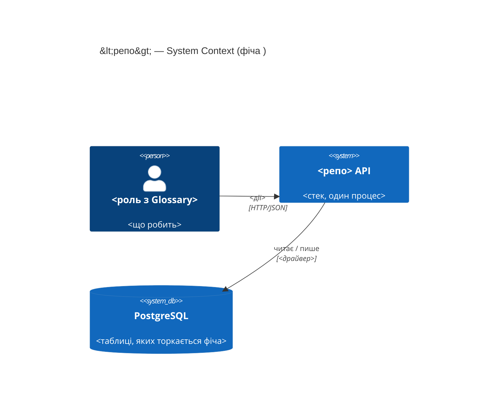
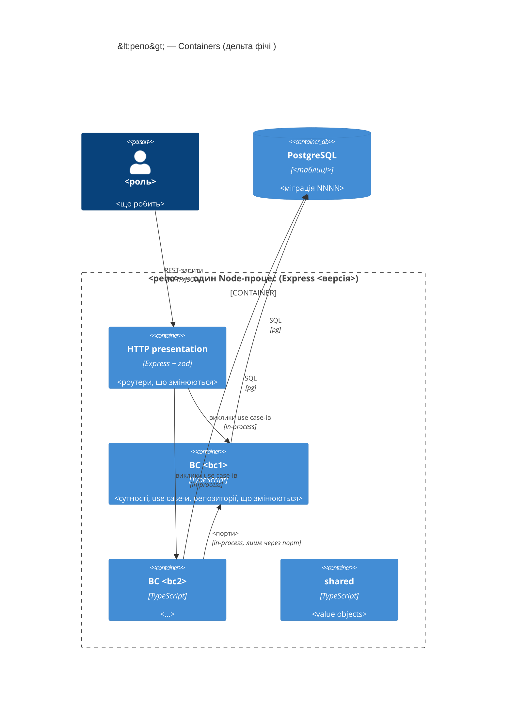
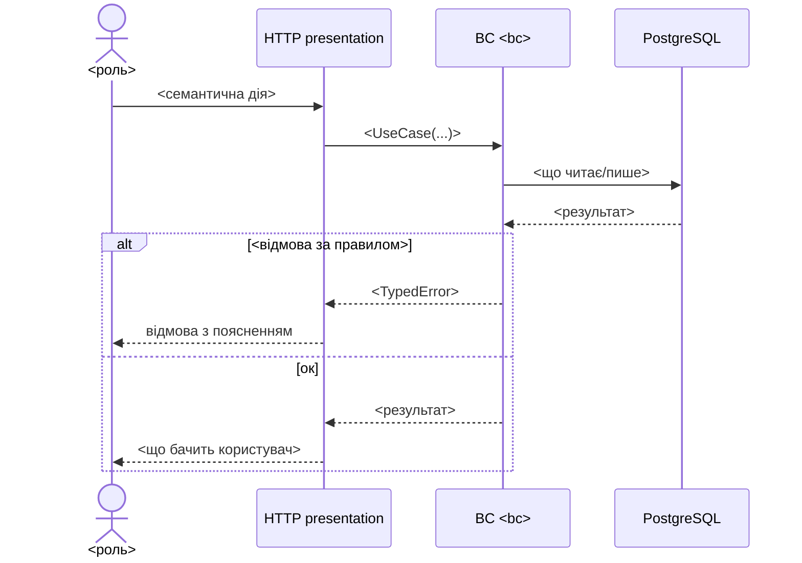

# Software Architecture Document — multi-currency-summary

<!-- arch-forge: 12 секцій arc42. Порожня секція — лише як <!-- N/A: причина --> (§7 має фіксований текст нижче). -->
<!-- C4 Context (L1) — inline у §3; C4 Container (L2) — inline у §5; L3/L4 не малюємо. -->
<!-- Джерела за пріоритетом: кореневий CONTEXT.md (Glossary + Invariants) → PRD → Explore-звіт → рішення попередніх секцій. -->
<!-- Заповнені приклади: docs/features/trip-budget/sad.md (курсовий скіл), docs/features/<наступна>/sad.md (цей скіл). -->

## 1. Introduction and goals

<!-- arch-forge: 1 абзац intent з PRD §1–§2 своїми словами + «як пов'язана з сусідніми фічами» (посилання на їх SAD/ADR),
     топ-3 якості з PRD §6 NFR (числа дослівно) і §5 AC (інваріанти — теж якість), stakeholders дослівно з Glossary.
     Для pet-фіч роль PM відсутня — так і пиши, не вигадуй ролі. -->

**Intent.** <що будуємо, для кого, який підхід з idea-brief §13; чи brownfield і що саме розширює>

**Top-3 quality goals (1-liners; сценарії у §10; терміни у §12):**

1. **QG-1 <якість> — <число з PRD §6 NFR>.** <одне речення>
2. **QG-2 <якість> — <число з PRD §6 NFR>.** <одне речення>
3. **QG-3 <інваріант/ізоляція з CONTEXT Invariants або AC>.** <одне речення>

**Stakeholders.**

| Role | Interest | Sign-off owner? |
|---|---|---|
| `<роль з Glossary>` | <що робить з фічею> | No |
| Tech Lead (<хто>) | архітектурний sign-off, ADR, dependency rule | **Yes** |

## 2. Constraints

<!-- arch-forge: версії — з lockfile (Explore §a), не з package.json-діапазонів; що НЕ зафіксовано (версія Postgres,
     відсутні dev-залежності) — теж сюди і в §11. Organisational: effort з idea-brief §11 RICE E, дедлайн сезону з PRD §1.
     Conventions — посилання на CLAUDE.md + конкретні патерни з Explore. Regulatory — з PRD §6.1, для pet зазвичай «немає». -->

**Technical.**
- <мова/рантайм + версія> · <фреймворк + версія> · <драйвер БД + версія, «без ORM — docs/adr/0001»> · <валідація + версія> · <тести + версії>
- <БД + версія або «не зафіксована → §11»>; схема: <таблиці з migrations/ з ключовими колонками>; наступна міграція — `NNNN`.

**Organisational.**
- Effort: <person-weeks з RICE E>. Deadline: <дата/сезон — жорсткий чи ні>. Team: <хто>.

**Conventions.**
- CLAUDE.md: <шари, dependency rule, як BC спілкуються (порти), один use case = одна дія>.
- Помилки: <типізовані Error-класи → 404/409/422 у presentation>; ID: <randomUUID у application>; гроші: <Money у minor units>.
- AC → назва vitest-теста; міграції — нумеровані SQL-файли.

**Regulatory / external.**
- <з PRD §6.1 або «немає»>; межа доступу — <з SPEC/CLAUDE або посилання на §8>.

## 3. Context and scope

<!-- arch-forge: 2–3 речення бізнес-контексту; таблиця зовнішніх систем («немає» — теж рішення, записане словами);
     C4Context: Person з Glossary, System = репо, SystemDb = БД; зовнішні лише якщо реально є (Explore §e). -->

<контекст>

**Зовнішні системи — <є / немає (чому)>.**

<!-- brownfield: Explore-скан виконано <дата> / N/A — greenfield -->

**External systems (in / out):**

| Actor or system | Type | Interaction |
|---|---|---|
| `<роль>` | Person | <дії> |
| PostgreSQL | System (own datastore) | <таблиці> |

**C4 Context (L1):**



## 4. Solution strategy

<!-- arch-forge: 3 стовпи (2 для XS), кожен — з ПОСИЛАННЯМ на інцидент, AC або обмеження з §2/Invariants, і з назвою ADR,
     який з нього виріс (або «inline — 1 з 4 критеріїв»). Item-bank: де живе нове поле · як BC дістає чуже · форма відповіді
     · тип грошей · вид міграції. Рішення, що суперечить Invariants, — red flag: або переформулювати, або Override у §1 ¶4. -->

**Стратегічні стовпи (насіння для ADR):**

1. **<Стовп 1>** — <2–3 речення; Invariant/AC/інцидент; → ADR-NNNN або inline>.
2. **<Стовп 2>** — <…>.
3. **<Стовп 3>** — <…>.

Кожне тактичне рішення §5–§8 має простежуватись до одного зі стовпів; рішення, що суперечить стовпу, — рядок у §11.

## 5. Building block view

<!-- arch-forge: контейнери мого стека відомі наперед — HTTP presentation (Express + zod), по контейнеру на BC, shared,
     PostgreSQL. Малюй їх одразу і опиши лише ЗМІНИ: новий BC? новий порт? зворотний порт (→ ADR)? нова таблиця?
     Обов'язкові підблоки: «Дельта файлів» (+ новий / ~ змінюється) і «Дельта міграцій». -->

<1 абзац: стиль (Clean Architecture як у репо), що саме розширюємо, які порти між BC; breaking changes контрактів — назвати і відправити у §11>

**Дельта файлів (`+` новий, `~` змінюється):**

```
src/
├── shared/                 <…>
├── <bc-1>/
│   ├── domain/             <~/+ …>
│   ├── application/        <~/+ …>
│   ├── infrastructure/     <~/+ …>
│   └── presentation/       <~/+ …>
├── <bc-2>/                 <…>
└── presentation/app.ts     <~ зшивання портів / middleware>
```

**Дельта міграцій:** `migrations/NNNN_<назва>.sql` — <DDL одним рядком; expand-only / expand + backfill / contract; backfill є/немає> · або «немає — обчислення поверх наявних даних».

**C4 Container (L2):**



## 6. Runtime view

<!-- arch-forge: учасники = контейнери §5, повідомлення семантичні (без HTTP-дієслів/шляхів/статус-кодів — це стадія API).
     XS/S: 1–3 flow (по одному на ключову US + відмови у alt-гілках); M+: 3–5, включно з failure-mode.
     Кожен flow закінчується рядком «Тестовий слід» — назви vitest/supertest-тестів, що його доводять. -->

**Critical flow 1: <назва>** — <US-xx; AC-xx>.



**Тестовий слід:** `it('<happy path>')`, `it('<відмова>')` — <файл>.

**Critical flow 2: <назва>** — <або «немає — XS-фіча з одним flow»>.

## 7. Deployment view

<!-- arch-forge: дефолт для фіч в одному процесі — N/A з фіксованим текстом нижче + одне речення обсягу даних.
     Реальна топологія лише якщо фіча додає процес/воркер/чергу/сховище (тоді має бути узгоджена з §5). -->

<!-- N/A: фіча переюзає існуючий деплой — один Node-процес + PostgreSQL; реплік, порогів масштабування й моніторингу не змінює -->

Обґрунтування одним рядком: <що додає фіча; обсяг даних у цифрах з PRD §1>.

## 8. Crosscutting concepts

<!-- arch-forge: рядки передзаповнені дефолтами мого стека — підтверди або зміни; нові рядки лише якщо PRD §6/§6.1 цього вимагає.
     Рішення з 0–1 критерієм радіусу впливу живуть тут inline; що відкладено — рядок у §11 з owner+due. -->

| Concept | Convention | Where defined |
|---|---|---|
| Error handling | типізовані доменні Error-класи → presentation: відсутність 404, відмова state-машини 409, порушення правила даних 422; <нові класи фічі> | CLAUDE.md; `<bc>/domain/errors.ts` |
| Validation | zod лише на межі presentation; <нові поля і їх правила> | CLAUDE.md |
| Money & precision | `Money` — цілі minor units, невід'ємний; `Balance` — знакові; коефіцієнти — scaled integer; плаваюча точка заборонена | `src/shared/` |
| ID strategy | `randomUUID()` (v4) у application; <чи має нова сутність власний id> | CLAUDE.md |
| Access boundary | single-user: bind 127.0.0.1 + API-key middleware (SPEC.md); 401 без деталей | SPEC.md; `app.ts` |
| Cross-BC access | лише порти у `<споживач>/domain` + адаптери в `<споживач>/infrastructure`; напрямок <…>; зворотний порт — тільки з ADR | CLAUDE.md; ADR-NNNN |
| Persistence & migrations | нумеровані SQL-файли; <тип міграції фічі>; upsert `ON CONFLICT (id) DO UPDATE` | `migrations/` |
| Logging / Observability | `console`; латентність міряємо k6 smoke у CI і таймінгами supertest, трасування немає | — |
| Rate limiting | <немає у v1 / рядок у §11> | §11 |
| Internationalisation | N/A — повідомлення англійською, як у коді | — |

## 9. Architecture decisions

<!-- arch-forge: дзеркало папки adr/ — кожен файл має рядок, кожен рядок має файл. Колонка BC — з префікса імені файлу. -->

| # | BC | Title | Status | Section |
|---|---|---|---|---|
| NNNN | <bc> | <рішення у наказовій формі> | Accepted | §<N> |

ADR files live under `docs/features/<slug>/adr/NNNN-<bc>-<title>.md`.

Дивись: [[adr/NNNN-<bc>-<title>]]

## 10. Quality requirements

<!-- arch-forge: по сценарію на кожну QG з §1. Числа — ДОСЛІВНО з PRD §6 NFR (не округлювати, не вигадувати).
     How verify — назва тесту (`it('…')` у конкретному файлі) або k6-команда з CI, не «інтеграційний тест». -->

**QG-1. <якість>**
- **When:** <тригер з конкретними даними>
- **Then:** <очікування з числом з PRD §6>
- **How verify:** `<файл>.test.ts` — `it('…')`; <k6 smoke>

**QG-2. <якість>**
- **When:** <…>
- **Then:** <…>
- **How verify:** <…>

**QG-3. <інваріант / ізоляція>**
- **When:** <…>
- **Then:** <…>
- **How verify:** <…>

## 11. Risks and technical debt

<!-- arch-forge: перший рядок — продуктовий ризик (з PRD §10/idea-brief devil's advocate), далі breaking changes контрактів,
     brownfield gotchas з Explore (≥ 1), відкриті питання з edits-log (severity = «Open question», owner + due обов'язкові). -->

| Risk / debt | Severity | Mitigation | Owner |
|---|---|---|---|
| <продуктовий ризик> | High/Medium/Low | <…> | <owner> |
| <breaking change контракту> | Medium | <тести, стадія API> | <owner> |
| <brownfield gotcha з Explore> | Low/Medium | <…> | <owner> |
| Open architectural decision: <заголовок> | Open question | Resolve before <стадія/дата>; <причина> | <owner> |

**Accepted debt (acceptable in v1, plan to fix later):**
- <…>

## 12. Glossary

<!-- arch-forge: лише терміни, вжиті в тілі SAD; доменні — дослівно з кореневого CONTEXT (з NOT-межею), технічні —
     з позначкою «технічний термін» і кандидатурою у fix-term, якщо термін доменний за суттю. -->

| Term | Meaning |
|---|---|
| <доменний термін> | <дослівно з CONTEXT + NOT-межа> |
| <технічний термін> | Технічний термін (не з CONTEXT): <що це у коді> |
