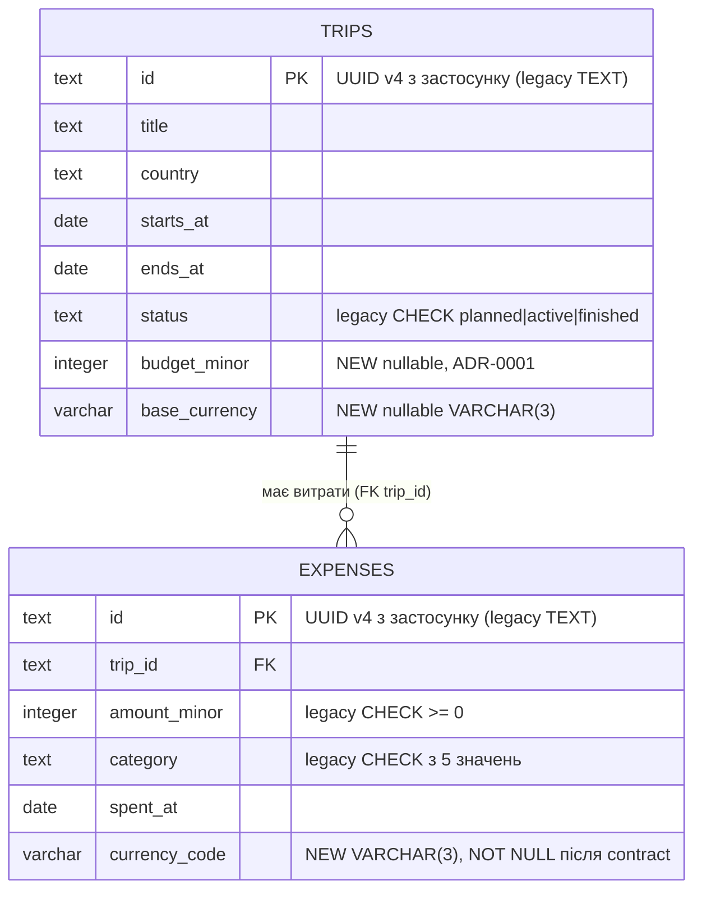

# Data model — trip-budget

<!-- Generated by generate-data-model (sdlc plugin v4.5.1, --mode brownfield). Migrations are STAGED under
docs/features/trip-budget/migrations/ (NOT the live migrations/ tree); implement-tasks promotes them. -->

Brownfield-дельта поверх `migrations/0001_create_trips.sql` і `0002_create_expenses.sql`: нових таблиць немає. Два зміни: (1) budget і base currency як атрибути поїздки (ADR-0001), (2) breaking change `expenses.currency TEXT` → `expenses.currency_code VARCHAR(3) NOT NULL` через expand → backfill → contract.

Навіщо (2) саме цій фічі: counted expense — це витрата, валюта якої дорівнює base currency поїздки (AC-06, CONTEXT trip-budget). Сьогодні `expensesRouter` приймає валюту як будь-який непорожній рядок, тож `'eur'` або `' EUR '` мовчки стали б uncounted, і remaining збрехав би. SAD §11 записав це як борг «вирівняти під ISO 4217» — тут він закривається на рівні даних.

## ER diagram

## Entities

### `trips` (aggregate root — BC trips)

| Column | Type | Constraints | Notes |
|---|---|---|---|
| `id` | TEXT | PK | legacy: UUID v4 як текст, генерується в application (`randomUUID()`) |
| `title`, `country` | TEXT | NOT NULL | legacy, без змін |
| `starts_at`, `ends_at` | DATE | NOT NULL | legacy, без змін |
| `status` | TEXT | NOT NULL, legacy `DEFAULT 'planned'` + CHECK | legacy, без змін (див. аудит — розходження з course defaults) |
| `budget_minor` | INTEGER | NULL | **new.** Мінорні одиниці, той самий тип що `expenses.amount_minor`; `NULL` = budget не задано. Правило «> 0» — у `Trip.setBudget()` + zod, не в БД |
| `base_currency` | VARCHAR(3) | NULL | **new.** ISO 4217; фіксується першим заданням budget (ADR-0001). Правило «разом з budget» — у домені |

**Aggregate root:** root. Budget — атрибут поїздки без власного життєвого циклу (ADR-0001), окремої таблиці немає.
**Access patterns:** читання/запис по `id` (flow 1 «знайти поїздку», «зберегти поїздку (upsert)»; `TripBudgetPort` у flows 2, 3) → PK.
**Constraints:** нових немає. `updated_at` свідомо не додано: заміна budget перезаписує значення без журналу (PRD §3, AC-07), вимоги «коли змінено» у PRD немає.

### `expenses` (aggregate root — BC expenses)

| Column | Type | Constraints | Notes |
|---|---|---|---|
| `id` | TEXT | PK | legacy |
| `trip_id` | TEXT | NOT NULL, FK → `trips(id)` | legacy, індекс `idx_expenses_trip_id` є |
| `amount_minor` | INTEGER | NOT NULL, legacy CHECK ≥ 0 | legacy |
| `currency` | TEXT | NOT NULL → NULL (крок 1) → **видаляється** (крок 3) | legacy, будь-який непорожній рядок |
| `currency_code` | VARCHAR(3) | NULL (крок 1) → NOT NULL (крок 3) | **new.** ISO 4217 у верхньому регістрі; `^[A-Z]{3}$` перевіряє zod і домен, не БД |
| `category` | TEXT | NOT NULL, legacy CHECK | legacy |
| `spent_at` | DATE | NOT NULL | legacy |

**Aggregate root:** root свого BC; з `trips` пов'язана лише по `trip_id` (CLAUDE.md, dependency rule).
**Access patterns:** «усі витрати поїздки» (flows 2, 3; `findByTrip`) → `idx_expenses_trip_id`. Групування по (категорія, валюта) і `BudgetBlock` рахуються в застосунку поверх ≤ 300 рядків — індекс по `currency_code` не потрібен.
**Constraints:** нових немає.

## Breaking change: `expenses.currency` → `expenses.currency_code`

Три staged-міграції = три PR = три деплої:

| Крок | Міграція | Код у тому ж PR | Порядок деплою |
|---|---|---|---|
| 1 expand | `20260928120100_add_currency_code_to_expenses` — `ADD currency_code NULL`, `currency DROP NOT NULL` | `PostgresExpenseRepository.save` пише обидві колонки (`currency` як ввели, `currency_code` нормалізовано); читає `currency` | міграція → код |
| 2 backfill | `20260928120200_backfill_currency_code_in_expenses` — UUID-курсор, батч 1000, [супутник](./backfill-currency-code.md) | читання переходить на `currency_code`; запис — обидві | міграція → код |
| 3 contract | `20260928120300_contract_currency_on_expenses` — `currency_code SET NOT NULL`, `DROP currency` | запис лише `currency_code`; `ExpenseRow` без `currency` | **код → міграція** (post-deploy) |

`currency DROP NOT NULL` стоїть уже в кроці 1: код кроку 3 перестає писати `currency` до того, як міграція її видалить, і NOT NULL на старій колонці зламав би вставки у проміжку між деплоєм і міграцією.

## Indexes

| Index | Columns | Query it serves |
|---|---|---|
| `idx_expenses_trip_id` (існує, 0002) | `expenses(trip_id)` | flows 2, 3: «усі витрати поїздки» для підсумку і `BudgetBlock` |

Нових індексів немає — жоден крок sequence-діаграм не шукає по `budget_minor`, `base_currency` чи `currency_code`. `idx_trips_status` (0001) цією фічею не використовується, лишається як є.

## Seeds

Немає. Довідника валют у v1 немає (SAD §8: патерн `^[A-Z]{3}$` замість таблиці), bootstrap-даних фіча не потребує.

## Test fixtures

<!-- TBD: згенерувати на implement-tasks — зараз полів budget/baseCurrency у domain немає, фабрика не скомпілюється (tsc strict). -->

У репо немає модуля фікстур: тести створюють сутності конструктором і працюють з `InMemory*Repository`. Заплановано:

- `aTrip({ budget?, baseCurrency?, status? })` — `src/trips/testing/aTrip.ts`, дефолти `Test Trip`, `PT`, 2026-10-01…15.
- `anExpense({ tripId, currency? })` — `src/expenses/testing/anExpense.ts`, дефолт валюти `EUR`.

PII guard: у фабриках і в сиді roundtrip — лише `Test Trip`, детерміновані UUID `00000000-0000-7000-8000-…`.

## Roundtrip

`scripts/db-roundtrip.sh docs/features/trip-budget/migrations` (Postgres 17 з `docker-compose.yml`, golang-migrate v4.18.3): baseline 0001+0002 + сид з `'EUR'`, `'eur'`, `' uah '` → up → down -all → up. Down повертає схему baseline (колонки, типи, nullability, defaults, constraints, індекси), другий up дає `pg_dump -s` байт-у-байт як перший. Два відомі нюанси down кроку 3: колонка `currency` повертається в кінець таблиці, а значення — у канонічній формі (`EUR`, `UAH`), сирі написання після contract не зберігаються.
