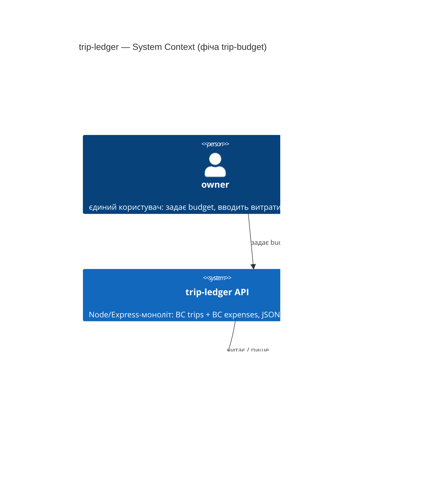
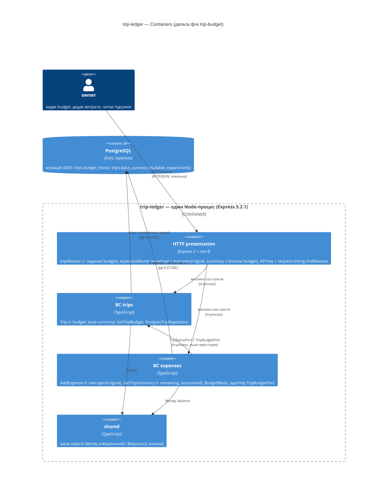

# Software Architecture Document — trip-budget

<!-- Stages 04-05 → see sdlc/plugin/skills/architecture-design/SKILL.md -->
<!-- 12 Arc42 sections. Empty sections — <!-- N/A: <one-line reason> -->. -->
<!-- C4 Context (L1) lives inline in §3. C4 Container (L2) lives inline in §5. -->
<!-- Заповнений приклад: див examples/course-lesson-mvp/sad.md у sdlc/ toolkit. -->

## 1. Introduction and goals

**Intent.** trip-budget додає до поїздки планову стелю витрат — один `budget` однією сумою в `base currency`. Далі система сама відповідає на два питання, які зараз owner рахує в голові: «скільки ще можна витратити» (`remaining` у підсумку поїздки) і «чи я вже вийшов за план» (`overspend signal` прямо у відповіді на додавання витрати). Витрати в інших валютах у порівняння не входять, але підсумок чесно показує їх лічильником `uncounted expenses` — це Approach A з idea-brief §13 (RICE 8), без конвертації валют, без прогнозів і без розбивки по категоріях.

Це brownfield-фіча: розширює два наявні bounded context-и (`src/trips`, `src/expenses`) і `src/shared`, нових процесів і сервісів не додає.

**Top-3 quality goals (1-liners; full scenarios у §10; терміни у §12):**

1. **QG-1 Точність грошей — 0 похибки округлення.** Усі суми (budget, витрати, remaining) живуть у цілих мінорних одиницях (integer), як `Money`; плаваючої точки в арифметиці немає (PRD §6 NFR «Точність грошей»).
2. **QG-2 Латентність і пропускна здатність існуючих ендпойнтів не деградує.** Підсумок із блоком залишку — p95 ≤ 250 ms; задання/заміна budget — p95 ≤ 150 ms; ≥ 30 req/s на 1 інстанс (PRD §6 NFR).
3. **QG-3 Ізоляція домену: budget — план, не заборона і не мутація.** Витрата приймається завжди, навіть з перевищенням (інваріант словника); зміна budget не мутує жодну витрату — remaining є шаром поверх (AC-04, AC-05); межа між BC зберігається — `expenses` бачить `trips` лише через порт (CLAUDE.md).

**Stakeholders.**

| Role | Interest | Sign-off owner? |
|---|---|---|
| `owner` | Єдиний користувач: задає budget, вводить витрати, читає підсумок; хоче дізнаватись про перевитрату в поїздці, а не вдома | No |
| Tech Lead (я ж, автор фічі) | Архітектурний sign-off, ADR, дотримання dependency rule з CLAUDE.md | **Yes** |
| PM | Відсутній (pet-проєкт); підтвердження §10 Quality Goals бере на себя owner | No |

## 2. Constraints

**Technical.** (перевірено Explore-сканом репозиторію проти `package-lock.json` і `migrations/`)
- TypeScript 7.0.2, `strict`, module `NodeNext`; Node ≥ 22 (`engines`), локально v24.18.0.
- Express 5.2.1 — єдиний транспорт, JSON API без UI (SPEC.md).
- pg 8.23.0 напряму, без ORM — docs/adr/0001; репозиторії пишуться руками під інтерфейси з `domain/`.
- zod 4.4.3 — лише у `presentation/` (`safeParse` → 422 `{errors}`).
- vitest 4.1.11 + supertest 7.2.2; тести колокуються як `*.test.ts`, HTTP-тести їздять поверх `createApp` з in-memory репозиторіями.
- PostgreSQL — версія в репо ніде не зафіксована (немає docker-compose, лише `DATABASE_URL` у `.env.example`) → §11.
- Схема: `trips(id TEXT PK, title, country, starts_at, ends_at, status CHECK planned|active|finished)`, `expenses(id TEXT PK, trip_id FK, amount_minor INTEGER CHECK ≥ 0, currency TEXT, category CHECK …, spent_at)`. Колонок budget/base currency **немає**.
- Міграції — нумеровані SQL-файли у `migrations/` (`0001_…`, `0002_…`); наступна — `0003`.
- Каналів доставки поза відповіддю сервісу (UI, пуші, листи) немає і не буде у v1 (PRD §3) — єдиний спосіб щось повідомити owner-у — тіло HTTP-відповіді на його ж запит.

**Organisational.**
- Effort budget: 1 person-week (idea-brief §11 RICE E = 1; F1/F2 займали по вечору).
- Deadline: довга поїздка у жовтні 2026 — **жорсткий** сезонний дедлайн: не встигнемо — наступне бойове вікно взимку (PRD §1).
- Team: 1 людина (owner = розробник = архітектор).

**Conventions.**
- CLAUDE.md: Clean Architecture, чотири шари на BC, залежності тільки всередину; `domain/` не імпортує фреймворків; `trips` і `expenses` не імпортують один одного — тільки `shared/` або через порт (`TripStatusPort` → `TripRepositoryStatusPort` в infrastructure).
- Один use case = один клас з `execute()`; доменні сутності — класи без декораторів, інваріанти у конструкторі/методах.
- Помилки: типізовані доменні Error-класи (`TripNotFoundError` → 404, `TripNotAcceptingExpensesError` → 409), zod-валідація → 422; мапінг лише у `presentation/`.
- ID: `randomUUID()` (v4) генерується у application-шарі; гроші — `Money` у цілих мінорних одиницях, `add()` кидає на розбіжності валют.
- AC → назва vitest-теста (конвенція з PRD/prd-forge): кожен AC з PRD §5 має читатись як `it('…')`.

**Regulatory / external.**
- Немає. Дані — особисті фінансові записи owner-а, класифікація `internal`, нових PII-полів немає, security review N/A (PRD §6.1).
- Межа доступу v1 — single-user: SPEC.md фіксує «один власник, API-key в .env»; механізм — §8, закриває PRD §8 OQ #1.

## 3. Context and scope

trip-ledger — локальний REST API для обліку власних поїздок і витрат; єдиний актор — `owner`. Фіча не додає зовнішніх інтеграцій: курси валют не тягнемо (інваріант словника «жодних зовнішніх залежностей за курсами»), каналів сповіщень (пуші, листи) немає і не буде у v1 (PRD §3). Кордон довіри — процес API: усе, що приходить по HTTP, валідується zod-ом на межі `presentation/`; за кордоном лише PostgreSQL.

**Зовнішні системи — немає.** Це свідоме рішення, записане замість мовчання: єдина «зовнішня» сутність — власна база даних.

<!-- brownfield: Explore-скан виконано 2026-09-02 (див. §2 Technical) -->

**External systems (in / out):**

| Actor or system | Type | Interaction |
|---|---|---|
| `owner` | Person | Задає/замінює budget; додає витрати й отримує overspend signal; відкриває підсумок із remaining та uncounted |
| PostgreSQL | System (own datastore) | Зберігає `trips` (+ `budget_minor`, `base_currency`) та `expenses` |
| Зовнішні сервіси (курси валют, сповіщення) | — | Відсутні за рішенням (PRD §3, CONTEXT «Out of scope») |

**C4 Context (L1):**



## 4. Solution strategy

**Top-3 strategic choices (the seeds for ADRs):**

1. **Budget — атрибут поїздки у BC `trips`, а не окрема сутність.** Словник каже: «budget — планова стеля витрат на поїздку однією сумою в base currency; NOT summary». Це план поїздки, у нього немає власного життєвого циклу й історії (PRD §3: історія змін budget — non-goal), тож він лягає двома nullable-колонками на `trips` і двома полями на `Trip`. Перше задання фіксує й base currency поїздки; заміна мусить бути в тій самій валюті (AC-02). Альтернативи — окрема 1:1-таблиця або третій BC — розглянуті в **ADR-0001**.
2. **Remaining і лічильник uncounted рахуються у BC `expenses` як чиста функція поверх наявного агрегата підсумку, budget читається через новий порт `TripBudgetPort`.** Інваріант словника: «будь-який перерахунок — окремий шар поверх, не мутація витрати»; AC-05 вимагає, щоб зміна budget не чіпала жодну витрату. `trips` нічого не знає про витрати (ARCHITECTURE.md), тому напрямок залежності лишається як у `TripStatusPort`: `expenses → trips` через інтерфейс у `expenses/domain` і адаптер у `expenses/infrastructure`. Альтернативи (композиція у presentation, розширення існуючого порту) — **ADR-0002**.
3. **Overspend signal повертається синхронно у відповіді на додавання витрати — без подій і без збереженого стану «вже попереджали».** Причина саме такого каналу: серпнева поїздка 2026 — перевитрата ~30% помічена лише постфактум удома (PRD §1); §2 фіксує, що іншого каналу доставки (пуші, листи) у системи немає і не буде у v1. Сигнал обчислюється щоразу з фактів (budget + витрати), тому він не може «застаріти» і не потребує таблиці попереджень. Альтернативи (окремий запит підсумку, сигнал у заголовку) — **ADR-0003**.

Each tactical decision in later sections should be traceable to one of these strategic seeds. Tactical decisions that *contradict* a strategic choice are red flags — surface them in §11 Risks.

## 5. Building block view

Стиль лишається тим самим, що й у F1/F2 — Clean Architecture з чотирма шарами на кожен BC (CLAUDE.md); фіча **розширює обидва наявні BC і `shared/`**, нового BC не створює (ADR-0001). `trips` отримує атрибути плану й один новий use case `SetTripBudget`; `expenses` — порт `TripBudgetPort`, його адаптер поверх `TripRepository` (дзеркало `TripRepositoryStatusPort`) і чисту функцію `BudgetBlock`, яку використовують і `AddExpense` (overspend signal), і `GetTripSummary` (блок залишку). Оскільки `Money` за інваріантом невід'ємний, а remaining за AC-03b має показуватись від'ємним, у `shared/` з'являється другий value object `Balance` зі знаком — `Money` не послаблюємо (**ADR-0004**).

Два наслідки для контрактів, які фіксуються остаточно на стадії 6.6 (API contracts): відповідь підсумку перетворюється з голого масиву `TripSummaryLine[]` на об'єкт `{ lines, budget }`, а відповідь додавання витрати — з голого `Expense` на envelope `{ expense, budget }`. Обидва — breaking change для єдиного клієнта (owner) і для наявних supertest-тестів → §11.

**Internal decomposition (дельта: `+` новий файл, `~` змінюється):**

```
src/
├── shared/
│   ├── Money.ts                                   (без змін: невід'ємні мінорні одиниці)
│   └── Balance.ts                               + ADR-0004: знакові мінорні одиниці + валюта; of(Money).minus(Money), isNegative()
├── trips/
│   ├── domain/Trip.ts                           ~ + budget?: Money, baseCurrency?: string, setBudget()
│   ├── domain/errors.ts                         + TripDoesNotExistError, BudgetCurrencyMismatchError — власні помилки BC trips, без імпортів з expenses
│   ├── application/SetTripBudget.ts             + один use case = одна дія; дозволений у будь-якому статусі, включно finished (AC-09)
│   ├── infrastructure/PostgresTripRepository.ts ~ мапінг budget_minor / base_currency (nullable)
│   └── presentation/tripsRouter.ts              ~ маршрут задання budget + zod-схема (сума ціла додатна, валюта — код ISO 4217 ^[A-Z]{3}$)
├── expenses/
│   ├── domain/Expense.ts                        ~ + інтерфейс TripBudgetPort { budget(tripId): Promise<{amount: Money} | null> }
│   ├── application/BudgetBlock.ts               + чиста функція: (budget, expenses[]) → { budget: Money, remaining: Balance, counted, uncounted, overspend }
│   ├── application/AddExpense.ts                ~ повертає { expense, budget: BudgetBlock | null } — ADR-0003
│   ├── application/GetTripSummary.ts            ~ повертає { lines: TripSummaryLine[], budget: BudgetBlock | null } — ADR-0002
│   ├── infrastructure/TripRepositoryBudgetPort.ts + адаптер порту поверх TripRepository (як TripRepositoryStatusPort)
│   └── presentation/expensesRouter.ts           ~ envelope відповіді; summary → об'єкт
├── presentation/app.ts                          ~ зшивання TripBudgetPort; API-key middleware і request-timing middleware (§8)
migrations/
└── 0003_add_trip_budget.sql                     + ALTER TABLE trips ADD budget_minor INTEGER NULL CHECK (budget_minor > 0),
                                                     ADD base_currency TEXT NULL; CHECK ((budget_minor IS NULL) = (base_currency IS NULL))
```

**C4 Container (L2):**



## 6. Runtime view

Учасники — контейнери з §5; повідомлення семантичні, без HTTP-методів і шляхів (ендпойнт-рівневі діаграми — стадія 6.6).

**Critical flow 1: owner задає (або замінює) budget поїздки** — US-01, US-05, US-06; AC-01, AC-02, AC-07, AC-09.

```mermaid
sequenceDiagram
    actor O as owner
    participant HTTP as HTTP presentation
    participant T as BC trips
    participant DB as PostgreSQL

    O->>HTTP: задати budget поїздки (сума, валюта)
    HTTP->>HTTP: перевірити форму: сума ціла й додатна, валюта вказана
    alt форма невалідна
        HTTP-->>O: відмова з поясненням: budget — додатна сума в base currency
    else форма валідна
        HTTP->>T: SetTripBudget(tripId, budget)
        T->>DB: знайти поїздку
        alt поїздки немає
            DB-->>T: порожньо
            T-->>HTTP: TripDoesNotExistError (власна помилка BC trips)
            HTTP-->>O: відмова: поїздку не знайдено
        else поїздка є (будь-який статус, включно finished — AC-09)
            DB-->>T: trip (+ поточний budget / base currency, якщо були)
            alt base currency вже зафіксована й валюта інша
                T-->>HTTP: BudgetCurrencyMismatchError
                HTTP-->>O: відмова з поясненням: budget задається саме в base currency поїздки
            else перше задання або та сама валюта
                T->>T: trip.setBudget(budget) — замінити значення, без журналу (AC-07)
                T->>DB: зберегти поїздку (upsert)
                DB-->>T: ok
                T-->>HTTP: trip з budget
                HTTP-->>O: підтвердження; підсумок відтепер показує блок залишку
            end
        end
    end
```

**Critical flow 2: owner додає витрату й одразу отримує overspend signal** — US-03, US-04; AC-04, AC-06 (ADR-0003).

```mermaid
sequenceDiagram
    actor O as owner
    participant HTTP as HTTP presentation
    participant E as BC expenses
    participant T as BC trips
    participant DB as PostgreSQL

    O->>HTTP: додати витрату (сума, валюта, категорія, дата)
    HTTP->>E: AddExpense(...)
    E->>T: поїздка існує? приймає витрати? (TripStatusPort)
    alt поїздки немає
        T-->>E: не існує
        E-->>HTTP: TripNotFoundError
        HTTP-->>O: відмова: поїздку не знайдено
    else поїздка finished
        T-->>E: не приймає
        E-->>HTTP: TripNotAcceptingExpensesError
        HTTP-->>O: відмова: поїздка завершена
    else приймає
        T-->>E: так
        E->>DB: зберегти витрату (завжди — budget ніколи не блокує)
        DB-->>E: ok
        E->>T: budget поїздки (TripBudgetPort)
        alt budget не задано
            T-->>E: немає
            E-->>HTTP: { expense, budget: null }
        else budget задано
            T-->>E: budget у base currency
            E->>DB: усі витрати поїздки
            DB-->>E: expenses[]
            E->>E: BudgetBlock: counted = витрати в base currency, uncounted = решта, remaining = budget − Σ counted (Balance, може бути < 0)
            E-->>HTTP: { expense, budget: { budget, remaining, counted, uncounted, overspend } }
        end
        HTTP-->>O: витрату прийнято; якщо remaining < 0 — overspend signal у тій самій відповіді
    end
```

**Critical flow 3: owner відкриває підсумок поїздки з залишком і лічильником неврахованих** — US-02, US-04; AC-03, AC-03b, AC-05, AC-06, AC-06b (ADR-0002).

```mermaid
sequenceDiagram
    actor O as owner
    participant HTTP as HTTP presentation
    participant E as BC expenses
    participant T as BC trips
    participant DB as PostgreSQL

    O->>HTTP: відкрити підсумок поїздки
    HTTP->>E: GetTripSummary(tripId)
    E->>DB: усі витрати поїздки
    DB-->>E: expenses[]
    E->>E: рядки по (категорія, валюта) — як зараз
    E->>T: budget поїздки (TripBudgetPort)
    alt budget не задано
        T-->>E: немає
        E-->>HTTP: { lines, budget: null } — підсумок як раніше
    else budget задано
        T-->>E: budget у base currency
        E->>E: BudgetBlock: counted / uncounted; remaining = budget − Σ counted
        Note over E: усі витрати чужовалютні → remaining = повний budget, uncounted = усі (AC-06b)
        E-->>HTTP: { lines, budget: { budget, remaining, counted, uncounted, overspend } } — та сама форма блоку, що у flow 2
    end
    HTTP-->>O: підсумок; від'ємний remaining показується від'ємним, не нулем (AC-03b)
```

## 7. Deployment view

<!-- N/A: S-фіча переюзає існуючий деплой — один Node-процес (Express) + PostgreSQL; реплік, порогів масштабування й моніторингу не змінює -->

Обґрунтування одним рядком: фіча додає дві nullable-колонки, один use case і чисту функцію всередині того самого процесу; жодного нового воркера, черги чи сховища (узгоджено з §5 — у C4 Container нового deployment unit немає). Обсяг даних: 4–6 поїздок на рік × ≤ 300 витрат (припущення SAD: 30-денна поїздка × 10 витрат/день; PRD §1 дає лише «3–10 витрат на день») — далеко від будь-яких порогів партиціонування.

## 8. Crosscutting concepts

| Concept | Convention | Where defined |
|---|---|---|
| Error handling | Типізовані доменні помилки → мапінг у `presentation/`: відсутність → 404 (`TripNotFoundError` у expenses, новий `TripDoesNotExistError` у trips), відмова state-машини → 409 (`TripNotAcceptingExpensesError`), порушення правила даних → 422 (zod-валідація та новий `BudgetCurrencyMismatchError`). Кожен BC володіє своїми класами помилок — `trips` не імпортує `expenses/domain/errors.ts`. Overspend — **не помилка**, а поле відповіді | CLAUDE.md «Конвенції»; `src/expenses/domain/errors.ts`; новий `src/trips/domain/errors.ts` |
| Validation | zod лише на межі `presentation/`; сума budget — `z.number().int().positive()`, валюта — код ISO 4217 `^[A-Z]{3}$` (PRD §6.1: «валюта — код з довідника»; повного довідника у v1 немає — патерн замість таблиці). Наявна схема витрат приймає будь-який непорожній рядок — вирівняти тією ж константою (§11) | CLAUDE.md; `tripsRouter.ts`, `expensesRouter.ts` |
| Money & precision | `Money` — цілі мінорні одиниці, невід'ємний, `add()` тільки в одній валюті; `Balance` — знакові мінорні одиниці для remaining (ADR-0004). Плаваюча точка заборонена | `src/shared/Money.ts`; ADR-0004 |
| ID strategy | `randomUUID()` (v4) у application-шарі; budget власного id не має — атрибут `Trip` (ADR-0001) | `AddExpense.ts`, `CreateTrip.ts` |
| Access boundary (AC-08) | v1 single-user: сервер слухає `127.0.0.1`; middleware у `app.ts` перевіряє заголовок з `API_KEY` (уже передбачений `.env.example` і SPEC.md) і відповідає 401 без деталей — існування поїздки не розкривається. Закриває PRD §8 OQ #1 (варіант «локальний запуск + owner-ключ») | SPEC.md «Non-goals»; `.env.example`; тут |
| Cross-BC access | Лише через порти в `expenses/domain` з адаптерами в `expenses/infrastructure`; напрямок `expenses → trips`, зворотного немає | CLAUDE.md «Dependency rule»; ADR-0002 |
| Persistence & migrations | Нумеровані SQL-файли; 0003 — expand-only (nullable колонки + CHECK), старі рядки валідні без backfill; upsert `ON CONFLICT (id) DO UPDATE` як у наявних репозиторіях | `migrations/`; `PostgresTripRepository.ts` |
| Logging | `console` як зараз; `LOG_LEVEL` з `.env.example` поки не читається — без змін у цій фічі | `.env.example` |
| Rate limiting | Не вводиться у v1 → відкрите питання у §11 (PRD §8 OQ #3, due стадія 6.6) | §11 |
| Observability | Трасування (OTel) свідомо не вводимо. Натомість request-timing middleware в `app.ts` пише `route`, `status`, `duration_ms` у `console` (JSON-рядок) — post-release p95 для PRD §7 KPI «latency підсумку» рахується з логів; латентність у CI — k6 smoke (§10) | `app.ts`; §10, §11 |
| Internationalisation | N/A — повідомлення помилок англійською, як у наявному коді | — |

## 9. Architecture decisions

| # | Title | Status | Section |
|---|---|---|---|
| 0001 | Зберігати budget і base currency колонками на `trips` (атрибути `Trip`), не окремою сутністю | Accepted | §4 |
| 0002 | Рахувати remaining і uncounted у BC `expenses` через порт `TripBudgetPort` | Accepted | §4, §5 |
| 0003 | Повертати overspend signal синхронно у відповіді на додавання витрати | Accepted | §4 |
| 0004 | Ввести знаковий value object `Balance` у `shared`, не послаблювати інваріант `Money` | Accepted | §5, §8 |

ADR files live under `docs/features/trip-budget/adr/NNNN-<title>.md`.

Дивись: [[adr/0001-budget-as-columns-on-trips]] · [[adr/0002-remaining-computed-in-expenses-via-trip-budget-port]] · [[adr/0003-overspend-signal-inline-in-add-expense-response]] · [[adr/0004-signed-balance-value-object-in-shared]]

## 10. Quality requirements

Each top-3 goal from §1 expanded into a full scenario:

**QG-1. Точність грошей**
- **When:** budget 100 000 мінорних одиниць, три counted-витрати по 33 333; окремо — counted-витрати, що перевищують budget на 1 мінорну одиницю.
- **Then:** remaining дорівнює рівно 1 і рівно −1 відповідно; 0 похибки округлення — арифметика лише в цілих мінорних одиницях, без плаваючої точки (PRD §6 NFR «Точність грошей»).
- **How verify:** `src/shared/Balance.test.ts` — `it('subtracts money in minor units without rounding')`, property-тест на випадкових цілих; `GetTripSummary.test.ts` — `it('remaining equals budget minus counted expenses in minor units')`, `it('shows negative remaining as negative, not zero')` (AC-03b).

**QG-2. Латентність і пропускна здатність**
- **When:** поїздка з 300 витратами (припущення SAD: 30-денна поїздка × 10 витрат/день — PRD §1 дає лише «3–10 витрат на день», профілю навантаження у PRD немає), budget задано; owner відкриває підсумок і замінює budget.
- **Then:** підсумок із блоком залишку — p95 ≤ 250 ms; задання/заміна budget — p95 ≤ 150 ms; сервіс тримає ≥ 30 req/s на 1 інстанс (PRD §6 NFR, числа дослівно).
- **How verify:** k6 smoke у CI на `GET /trips/:id/summary` і на write-ендпойнт budget (PRD §6 «Measurement»); локально — таймінг у supertest-тесті `it('summary with budget block responds under 250 ms for 300 expenses')`; post-release — p95 з request-timing логів (§8 Observability) для PRD §7 KPI.

**QG-3. Ізоляція домену**
- **When:** (а) нова витрата перевищує budget; (б) owner замінює budget за наявності витрат; (в) у `expenses` з'являється код, що імпортує `trips` напряму.
- **Then:** (а) витрата збережена, відповідь містить overspend signal — budget ніколи не блокує (AC-04); (б) жоден рядок `expenses` не змінився, remaining перерахований від нового значення (AC-05, AC-07); (в) збірка/lint падає.
- **How verify:** `AddExpense.test.ts` — `it('accepts an expense that exceeds the budget and returns overspend signal')`; `GetTripSummary.test.ts` — `it('replacing the budget does not touch stored expenses')`; правило імпортів — eslint `import/no-restricted-paths` (заплановано у docs/adr/0001, ще не підключене → §11), до того — code review по CLAUDE.md.

## 11. Risks and technical debt

| Risk / debt | Severity | Mitigation | Owner |
|---|---|---|---|
| Мультивалютна поїздка робить remaining «брехливим»: порівнюються лише витрати в base currency (перший ризик — продуктовий, PRD §10) | High | Лічильник uncounted у кожному підсумку з budget (AC-06/06b); наступна фіча multi-currency-summary додає rate snapshot і повертає такі витрати у порівняння | я (автор) |
| Breaking change форми відповідей: summary масив → об'єкт, додавання витрати → envelope (§5) | Medium | Єдиний клієнт — owner; оновити supertest-тести разом із кодом; контракт зафіксувати на стадії 6.6 до реалізації | я (автор) |
| Brownfield: `FinishTrip` існує, але не змонтований у `tripsRouter` — AC-09 (budget у finished поїздці) недосяжний через API | Medium | Змонтувати завершення поїздки окремою задачею на стадії 6.7 або перевіряти AC-09 через стан репозиторію в тестах | я (автор) |
| Перше задання budget фіксує base currency поїздки; зміни base currency у v1 немає — при помилковій валюті доведеться правити руками | Low | Валідація валюти на межі + чітке повідомлення (AC-02); правило зміни base currency визначить multi-currency-summary (її AC-07) | я (автор) |
| Версія PostgreSQL не зафіксована в репо; toolchain drift — `ts-node-dev`, `eslint`, `node-pg-migrate` викликаються з Makefile, але їх немає у `package.json` | Low | Зафіксувати версію Postgres і додати dev-залежності на стадії 6.5 (міграції) | я (автор) |
| PRD §6 і §7 посилаються на «метрику summary, що вже існує» — у коді жодних метрик немає (критик, F3) | Low | Request-timing middleware (§8) з'являється разом із фічею; post-release p95 рахується з логів — без нової інфраструктури | я (автор) |
| Open architectural decision: rate-limit 60/хв на заміну budget | Open question | Resolve before stage 6.6 (api-forge); PRD §8 ставить due саме туди; v1 без ліміту — єдиний клієнт owner, межа доступу закрита API-key | я (автор) |

**Accepted debt (acceptable in v1, plan to fix later):**
- Budget без історії змін — свідомо (PRD §3); якщо після першої поїздки виявиться потрібною, міграція на 1:1-таблицю описана як «Neutral» у ADR-0001.
- Dependency rule не enforce-иться інструментом (eslint-правило заплановане у docs/adr/0001) — до підключення тримаємось на code review.
- `BudgetBlock` двічі читає поїздку в `AddExpense` (статус через `TripStatusPort`, budget через `TripBudgetPort`) — два in-process виклики замість одного; об'єднати, якщо QG-2 почне тиснути.
- Схема додавання витрати приймає валюту будь-яким непорожнім рядком — вирівняти під ISO 4217 тією ж zod-константою, що й budget (поза scope PRD, але одна константа на два роутери).

## 12. Glossary

| Term | Meaning |
|---|---|
| owner | Єдиний користувач інструмента: задає budget, вводить витрати, читає підсумок. NOT «user»/«admin» — інших ролей немає |
| trip (поїздка) | Облікова одиниця подорожі зі статусом planned/active/finished і датами; контейнер витрат і носій budget |
| expense (витрата) | Фактична витрата з сумою, валютою і датою, прив'язана до поїздки лише по її id |
| budget (бюджет) | Планова стеля витрат на поїздку однією сумою в base currency. NOT summary (summary — факт, budget — план) |
| base currency | Валюта, у якій задається budget і рахується перевитрата. NOT валюта введення витрати |
| counted expense | Витрата у base currency поїздки, що входить у порівняння з budget |
| uncounted expense | Витрата в іншій валюті: у порівняння не входить, лише рахується лічильником у підсумку. NOT невалідна витрата |
| remaining (залишок) | budget мінус сума counted expenses; може бути від'ємним і показується від'ємним. NOT overspend |
| overspend / overspend signal | Стан перевищення budget і повідомлення про нього у відповіді на додавання витрати. Сигнал, не заборона |
| summary (підсумок) | Агрегат фактичних витрат поїздки по категоріях і валютах; з цією фічею — плюс блок budget/remaining/uncounted |
| minor units (мінорні одиниці) | Копійки/центи; єдина форма зберігання й арифметики грошей у системі (QG-1) |
| Balance | Технічний термін (не з CONTEXT): value object у `shared/` для знакових сум у мінорних одиницях — тип remaining (ADR-0004). Кандидат у CONTEXT через `fix-term` |
| TripBudgetPort | Технічний термін: інтерфейс у `expenses/domain`, через який `expenses` читає budget поїздки з `trips` (ADR-0002) |
