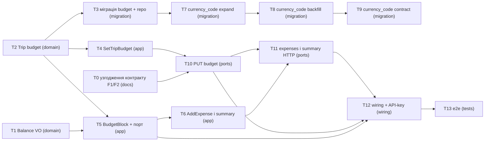

# Epic — trip-budget

> **PRD:** [PRD.md](../PRD.md) · **Design:** [sad.md](../sad.md) · **Data model:** [data-model.md](../data-model.md) · **API:** [openapi.yaml](../contracts/openapi.yaml) · **ADRs:** [adr/](../adr/)

## Goal

Після цього епіку owner бачить remaining і лічильник uncounted expenses прямо в підсумку поїздки, а про перевищення budget дізнається у відповіді на додавання витрати, а не вдома постфактум — три цілі [PRD §2](../PRD.md). Реалізація — Approach A: budget як атрибут поїздки ([ADR-0001](../adr/0001-budget-as-columns-on-trips.md)), блок залишку в `expenses` через порт ([ADR-0002](../adr/0002-remaining-computed-in-expenses-via-trip-budget-port.md)), сигнал у тій самій відповіді ([ADR-0003](../adr/0003-overspend-signal-inline-in-add-expense-response.md)), знаковий `Balance` ([ADR-0004](../adr/0004-signed-balance-value-object-in-shared.md)).

## Scope

- **In:** `src/shared` (`Balance`), BC `src/trips` (domain, application, infrastructure, presentation), BC `src/expenses` (domain-порт, application, infrastructure, presentation), `src/presentation` (композиція, API-key і request-timing middleware), staged-міграції з [`../migrations/`](../migrations/) (budget на `trips` + три кроки `expenses.currency` → `currency_code`). Поверхня — лише backend HTTP-сервіс, шару `ui` немає.
- **Out:** прогнози «вистачить до кінця поїздки», конвертація валют, сповіщення поза відповіддю сервісу, category caps, історія змін budget — [PRD §3](../PRD.md). Також поза епіком: монтування `FinishTrip` у роутер, rate-limit на заміну budget, k6 smoke у CI.

## Task map

Паралельні гілки: T0 ∥ T1 ∥ T2 на старті (T0 — рішення F1/F2, блокує T10); після T2 — T3, T4 і (з T1) T5 одночасно; migration-lane T3 → T7 → T8 → T9 іде паралельно всій HTTP-гілці T10 → T11 → T12 → T13.

## Tasks

See [tracker.md](./tracker.md) for status. Machine contract: [tasks.json](./tasks.json).

| # | Task | Layer | Blocked by | DoD (short) |
|---|---|---|---|---|
| T0 | [Узгодити контракт trip-budget з живим дротом: прогін contract-forge --update (F1/F2)](./T0-reconcile-contract-with-as-built-wire.md) | docs | — | lint 0 problems, спільні ендпойнти узгоджені з mcs, F1/F2 закриті |
| T1 | [Додати знаковий value object Balance у src/shared](./T1-balance-value-object.md) | domain | — | `Balance.test.ts` з property-тестом зелений, `Money` без змін |
| T2 | [Додати budget, base currency і setBudget() у доменну сутність Trip](./T2-trip-budget-domain.md) | domain | — | `Trip.test.ts` зелений для задання, заміни, чужої валюти, нуля, finished |
| T3 | [Промотувати міграцію budget на trips і змапити колонки в PostgresTripRepository](./T3-budget-migration-trip-repository.md) | migration | T2 | staged-пара промотована, roundtrip чистий, репозиторій зберігає budget |
| T4 | [Додати use case SetTripBudget у BC trips](./T4-set-trip-budget-use-case.md) | app | T2 | `SetTripBudget.test.ts` зелений для AC-01/02/07/09 |
| T5 | [Додати TripBudgetPort, чисту функцію BudgetBlock і адаптер TripRepositoryBudgetPort у BC expenses](./T5-budget-block-and-port.md) | app | T1, T2 | `BudgetBlock.test.ts` зелений для AC-03/03b/05/06/06b |
| T6 | [Повернути блок budget з AddExpense і GetTripSummary](./T6-add-expense-and-summary-budget.md) | app | T5 | витрата понад budget прийнята з сигналом, summary `{ lines, budget }` |
| T7 | [Крок 1/3 currency_code: промотувати expand-міграцію і ввімкнути dual-write у PostgresExpenseRepository](./T7-currency-code-expand.md) | migration | T3 | staged-пара промотована, roundtrip чистий, dual-write працює |
| T8 | [Крок 2/3 currency_code: промотувати backfill-міграцію і читати COALESCE(currency_code, currency)](./T8-currency-code-backfill.md) | migration | T7 | backfill ідемпотентний, неоднозначні лишаються NULL |
| T9 | [Крок 3/3 currency_code: перевести PostgresExpenseRepository лише на currency_code і промотувати contract-міграцію](./T9-currency-code-contract.md) | migration | T8 | 0 NULL, колонка `currency` видалена, roundtrip чистий |
| T10 | [Додати маршрут PUT /trips/{trip_id}/budget і презентер Trip у tripsRouter](./T10-put-trip-budget-endpoint.md) | ports | T0, T4 | HTTP-тести 200/422/404 за контрактом, `GET /trips/:id` без змін |
| T11 | [Перевести POST /trips/{trip_id}/expenses і GET /trips/{trip_id}/summary на форму контракту з блоком budget](./T11-expenses-endpoints-envelope.md) | ports | T6, T10 | HTTP-тести за `AddExpenseResponse` / `TripSummary`, збіг з fixtures |
| T12 | [Зшити TripBudgetPort у createApp і додати API-key та request-timing middleware](./T12-app-wiring-api-key.md) | wiring | T5, T10, T11 | 401 до читання сховища (AC-08), server не стартує без `API_KEY` |
| T13 | [Написати наскрізний HTTP-тест сценарію trip-budget з перевіркою латентності підсумку](./T13-e2e-trip-budget.md) | tests | T12 | e2e зелений, summary < 250 ms на 300 витратах |

## Risks / Hard rules

- **Hard rule — dependency rule** (CLAUDE.md, [sad §2](../sad.md) Conventions): `trips` і `expenses` не імпортують один одного; єдиний шов — адаптери в `expenses/infrastructure` (T5). `domain/` без фреймворків і zod.
- **Hard rule — budget ніколи не блокує** (CONTEXT Invariants, [PRD §AC-04](../PRD.md)): overspend — поле відповіді, не помилка й не статус (T6, T11).
- **Hard rule — 0 похибки округлення** ([PRD §6](../PRD.md)): уся арифметика в цілих мінорних одиницях через `Money` / `Balance` (T1, T5).
- **Pre-condition — рішення F2, тепер задача [T0](./T0-reconcile-contract-with-as-built-wire.md) у `deps` T10** (додано на рев'ю: готовий скіл не вміє виразити невирішений flag як залежність) ([api-sync-report](../contracts/api-sync-report.md)): контракт — snake_case, `/api/v1`, `{code, message}`, Bearer; живий код — camelCase, без префікса, `{error}` / `{errors}`. Блокує старт T10–T12.
- **Cross-feature міграція**: back-port CHECK-ів `docs/features/multi-currency-summary/migrations/20260928140100000_add_budget_checks_to_trips.sql` має йти одним деплоєм з T3 ([data-model.md](../data-model.md)).
- **Формат staged-міграцій**: пари golang-migrate, а живий раннер — node-pg-migrate ([.claude/rules/migrations.md](../../../../.claude/rules/migrations.md)); backfill з `COMMIT` потребує `pgm.noTransaction()` (T3, T7–T9).
- **Breaking change відповідей** POST expenses і GET summary ([sad §11](../sad.md)): T6 і T11 мерджити поспіль.
- **Бюджет часу**: оцінка ~6.5 person-days (з T0) проти 1 person-week з [sad §2](../sad.md) Organisational; жорсткий дедлайн — жовтнева поїздка 2026 ([PRD §1](../PRD.md)). Кандидат на відкладення — T9 (contract-крок можна деплоїти після поїздки).
